# 轶闻


这里是《你缺计课》独家专栏——编委会轶闻。

**所有内容纯属扯淡，切勿当真。**



警告：本章所有内容未经 Hans 审定及批准。



↑ 这个警告可以忽略。😉


## 你会前端吗？

我们的前端工程师如是说：

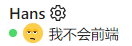

## 《致 ThinkPad 背后的你》


是的 
你不用像那些 Mac 用户一样 
时刻想着自己的 iCloud 空间是否已满 
因为你有 
随时买一块新硬盘并安装上的自由 

当他们在那赞叹 
一块按压不下去的玻璃薄片时 
你早已用轻盈的食指 
将光标从屏幕一头推向另一头


——【现代】Hans

此作一经发布，引起世界轰动。95% 的读者在问 Hans 是谁，剩下的 5% 在争论 [小红点](https://www.lenovo.com/hk/zh/glossary/trackpoint/) 到底用哪根手指推比较合适。

## 震惊！《你缺计课》居然……

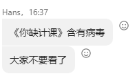

## 真正的空间管理大师

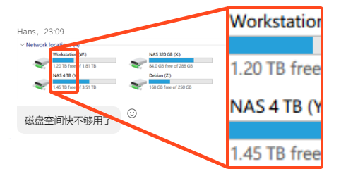

## 《你缺计课》编委会第一届诗词大会

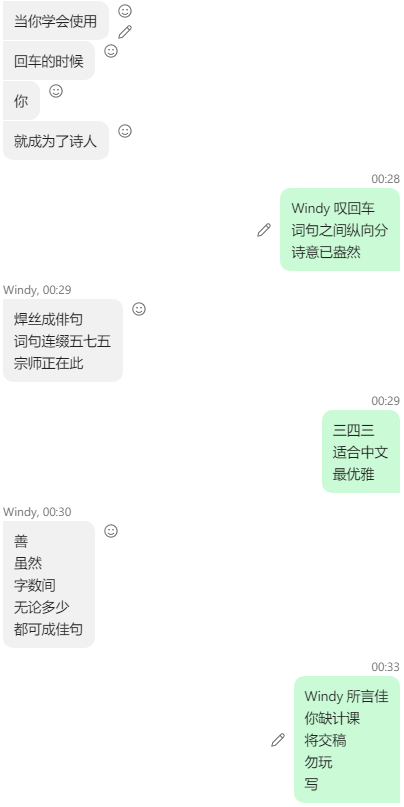

## 据说 Hans 用的是五笔

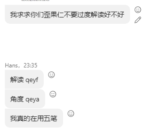

## 批判与自我批判

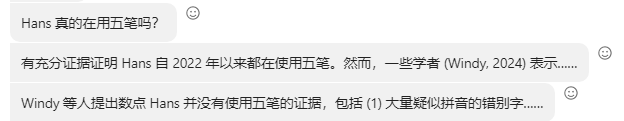

## 《原神》入脑

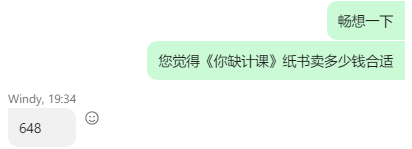

## 此地无银三百两

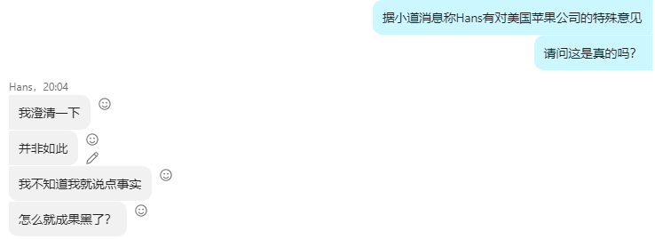

## 出师未捷

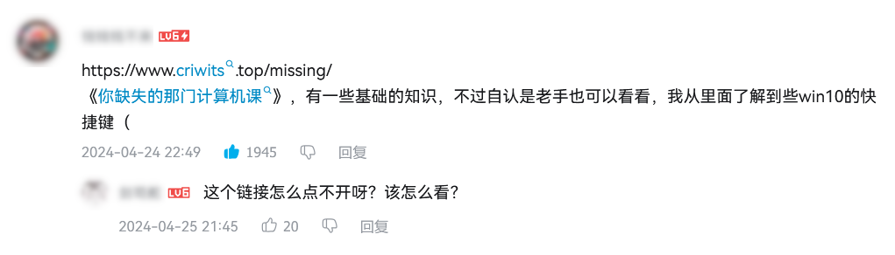

## Hans（正在睡觉）

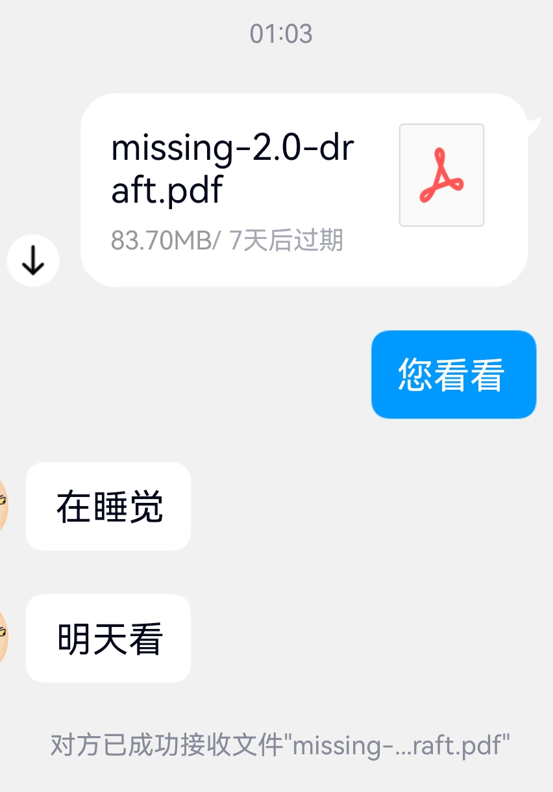

## 焊丝俳句秀

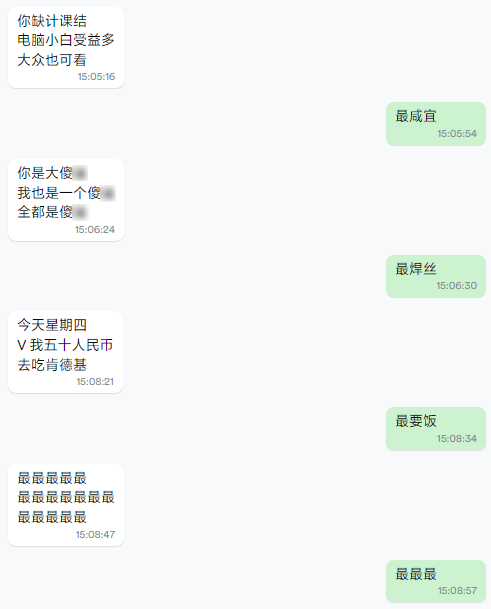

## 左右脑搏击

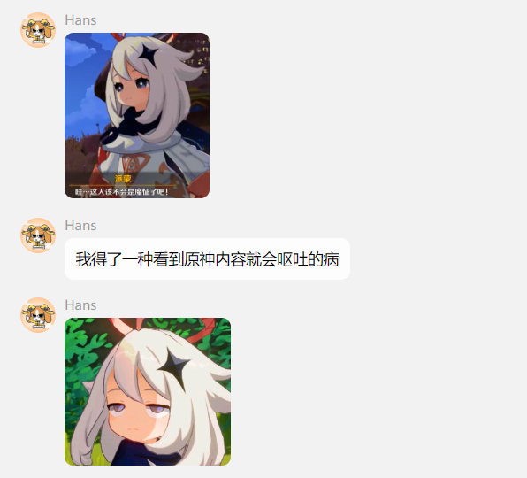

## 五十步笑五十步

水果比冰棍健康，焊丝还是赢了。

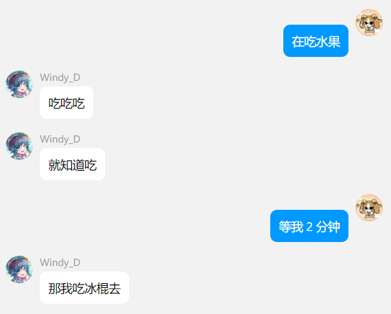

## 血肉苦痛，机械飞升

