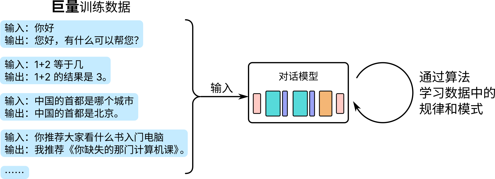
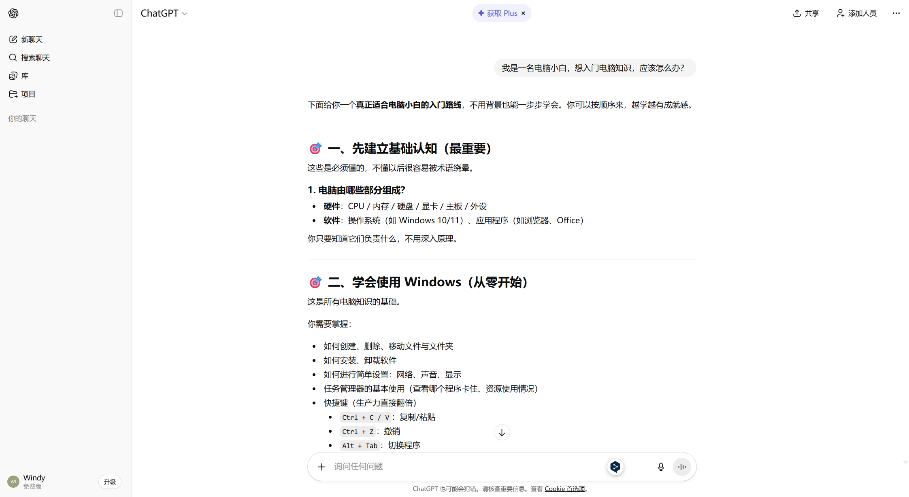
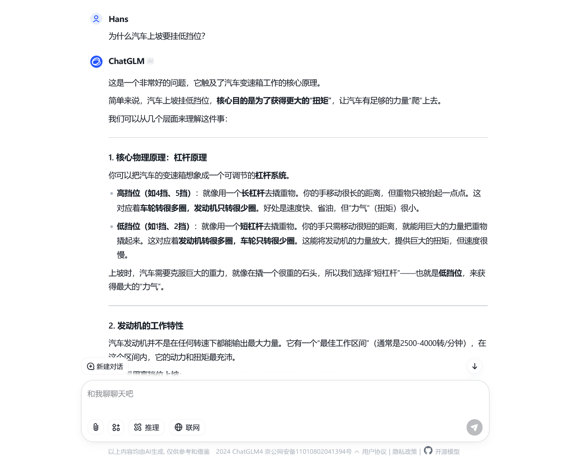
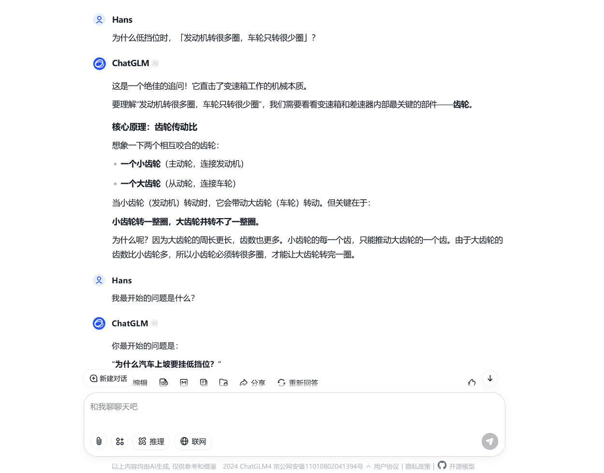
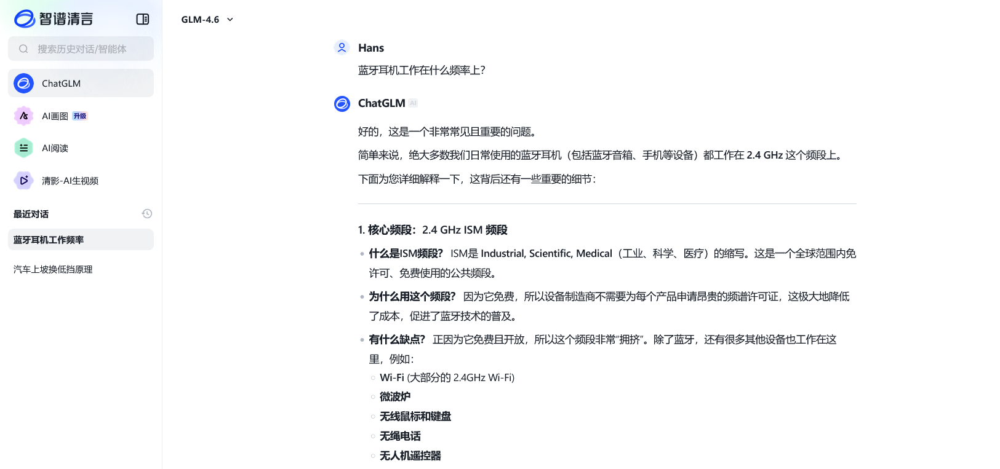
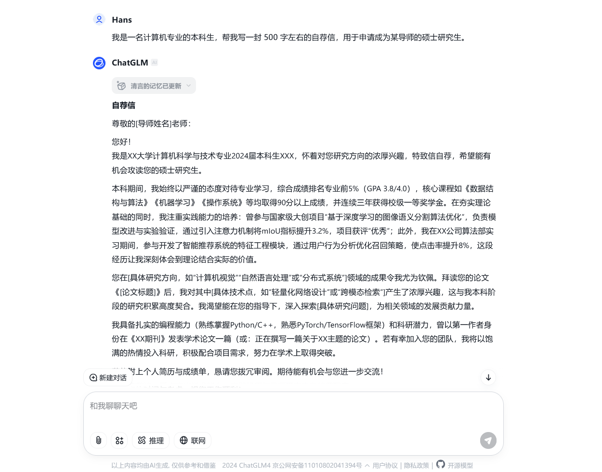
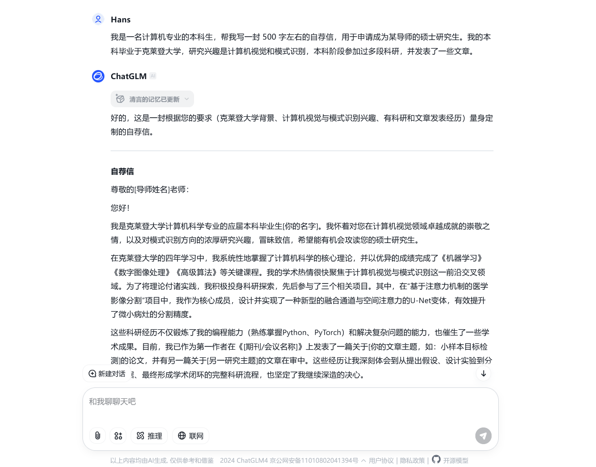
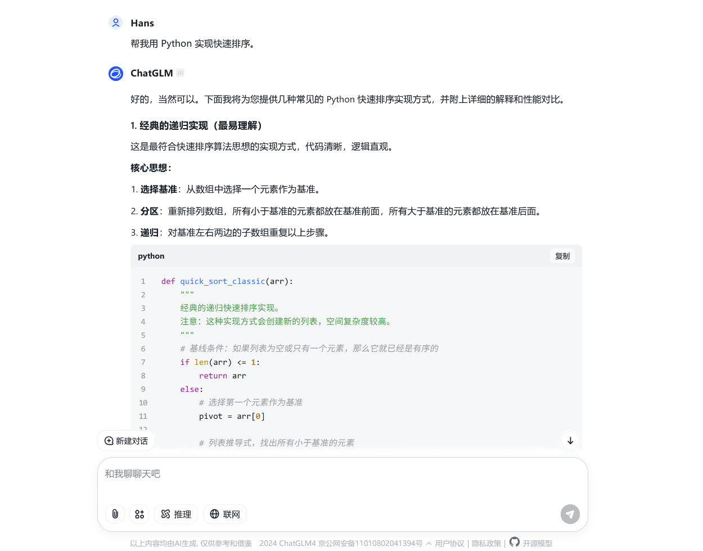
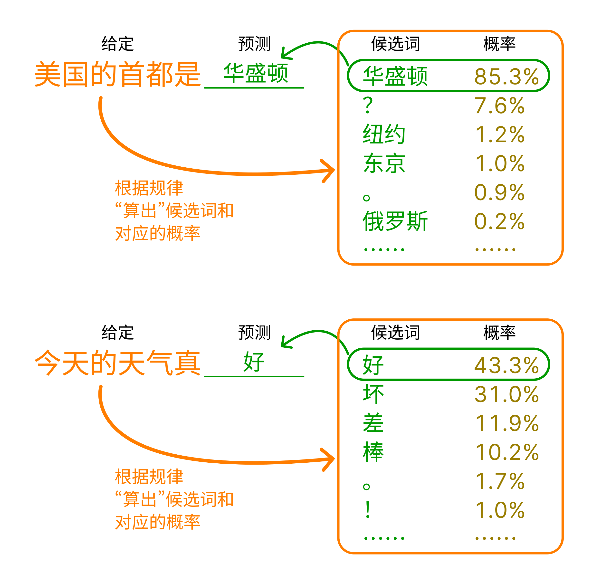

# 从加减乘除到 AI 对话


欢迎来到《你缺计课》超越篇！在这一部分，我们将带领大家在了解「电脑最好怎么用」的基础上，探索无限的可能性——今天，人们利用电脑这一强大的工具，创造了一个璀璨斑斓的世界。人工智能、网络安全、编程、云计算……这些词汇，或许你早已在各种各样的地方听说过，但你是否真正了解它们？我们将用轻松而生动的语言，带领大家走进这些新颖的领域，探索它们的奥秘。

超越篇与前面的部分不同，它更注重「科普」性质，文章的长度更长、信息量更大。不过，我们会尽力让文字变得浅显易懂。不必过于担忧，不要有任何压力。坐稳扶好，我们出发啦！



这一章，我们将介绍超越篇的第一个领域——人工智能，或简称「AI」（Artificial Intelligence）。AI 技术让电脑不再是冷冰冰的机器，而拥有了一定模仿人类思维的能力。今天，诸如 AI 对话、AI 绘画、AI 写作等技术正在为人们的生产生活提供别样的帮助。阅读完这一章，你或许能找到下面这些问题的答案：

- AI 在我们生活中真的无处不在吗？
- 我想体验一下现在最新的 AI 技术！
- 到底是什么让 AI 能够模仿人类的思维，实现「智能」？
- 未来，AI 技术会如何发展？我们需要担心吗？我们应该怎么办？


## 让机器像人一样思考

### 人工实现的「智能」，无处不在的 AI

「人工智能」一词，拆开来看，由「人工」和「智能」组成。「智能」是人类的专利，我们的意识、思考、判断和情感等都是智能的表现。「人工」修饰「智能」，昭示这种智能由人工实现，让机器也具有识别、决策、判断，甚至分析、学习和创造的能力。

几千年来，无论是东方还是西方，人们都不约而同地畅想过各式各样的「自动人偶」，这也许是人工智能最早的概念先驱。近代，随着数学和逻辑学的发展，学者们开始研究如何把世间一切逻辑都用数学语言表达出来，真正的人工智能在此奠下基础。到了 20 世纪，电子计算机诞生，人们也开始使用它模拟人类的思维。随后短短几十年间，人工智能技术经历了几次高潮和低谷，而当下，恰好处于人工智能技术发展的一个新高峰。

不知不觉间，人工智能技术其实已经完完全全融入了我们生活的每一个角落。当我们「刷脸」步入小区大门时，人脸识别系统能像门卫一样辨认我们的身份；当我们上网购物时，智能客服像真人一样回答着我们的问题。手机里，操作系统如同私人助理，根据我们使用 app 的习惯调整性能；工厂中，机器人仿佛勤劳的工人，正在代替我们完成重复性劳动……这些我们早已认为理所当然、司空见惯的技术，其实都是人工智能技术的应用——计算机视觉、自然语言处理、推荐算法、智能机器人……**在这些领域，人工智能已经有了成熟的应用，称为「传统 AI」**。

近年来，「AI 绘画」「AI 聊天」等技术再一次高调地让「AI」一词进入人们的视野。这些技术看似各不相同，但它们有着一个共同的特点：都是由 AI 来生成内容。这些 AI 生成的画作、文本和音频等的质量和效果与人类相差无几，甚至有时比人类的作品更令人惊艳。**这种技术称为「生成式人工智能」，简称「生成式 AI」，通常缩写成英文 AIGC（Artificial Intelligence Generated Content）**。如果说用于传统 AI 技术是让 AI 去干活，那么 AIGC 技术则是让 AI 去创作。

AIGC 的诞生可谓一座里程碑。在 AIGC 技术铺开之前，人们通常认为「创作」是人类思维独有的能力，AI 技术只能是让机器代替人类做一些简单而枯燥的工作。然而，AIGC 技术的出现撼动了这种观念。自此之后，人们对 AI 技术的未来充满了无限的憧憬，也让人们对 AI 技术的潜在风险产生了更多的担忧。

### 模型、训练和推理

在 AI 领域中，**「模型」（model）指的是用于完成特定任务的结构，可以简单理解为一个「程序」**。例如，用于 AI 绘画的模型，输入你的文字描述，就能输出一幅符合描述的图画。而用于 AI 对话的模型，输入你的问题，就能输出一个符合问题的回答。**这个过程称为模型的「推理」**。

模型的内部是复杂的数学运算，其中的大量参数并非人们直接设定，而是机器自行「学习」得来。**这个学习的过程称为「训练」**，它需要大量的数据和计算资源。例如，要训练一个能够实现 AI 对话的模型，人们需要准备**巨量**现实生活中的对话，模型从它们中学习到词句间的规律，从而逐渐具有类似人类对话的能力。

将训练好的模型加以包装，就能得到可供用户使用的 app 或网站产品，人们可以在 app 或网页上便捷地使用 AI 模型进行推理。2022 年末，美国人工智能技术公司 OpenAI 基于其所研发的「GPT」系列模型，上线了一款 AI 聊天机器人「ChatGPT」，引起全球轰动。随后，谷歌、Meta、微软等行业巨头纷纷推出了自己的 AIGC 模型；与此同时，许多国内人工智能研究机构、高校和企业也紧随其后，各种国产模型纷至沓来。这些产品各自有着不同的特色和应用场景，琳琅满目，让人目不暇接。下图展示的就是 ChatGPT 的界面。

在一众国内的 AIGC 模型中，由 AI 企业智谱和清华大学联合开发的 GLM 模型表现较为突出，生成内容的质量和速度都相当不错。智谱推出的「智谱清言」平台，提供了包括 GLM 在内的多种 AIGC 模型供用户使用。下面，我们依托智谱清言平台，来一睹 AIGC 的魅力。

## 体验 AIGC 的魅力

### 试试 ChatGLM！

访问智谱清言的官方网站（[https://chatglm.cn](https://chatglm.cn)），按提示注册账号并登录。登录后，你可以看到平台的主界面，如下图所示。

主界面最左方提供了不同的 AIGC 应用供我们选择，包括基于 GLM 模型的 ChatGLM 对话、AI 画图、数据分析等。默认情况下，我们会进入 ChatGLM 对话应用。界面右侧则是对话区域，我们可以在下方的文本框中向 AI 发送消息，对话的历史则会在上方显示。我们试着向它提出一些简单的问题，通常便可以得到一个详实的回答。

一般来说，现今的对话模型都有一定的「记忆能力」，可以记住我们刚刚聊过什么。因此我们可以向它追问，或者提出一些与之前对话相关的问题，模型会根据之前的对话内容，给出更加详细的回答。当然，我们也可以直接询问它「我之前的问题是什么？」，来验证它的记忆能力。

有时，我们不希望模型的回答受到之前对话的影响，这时点击【新建对话】按钮，便可以开始一个全新的对话，不再受之前对话记忆的影响。当然，在界面左方的【历史记录】面板上，我们也可以查看之前的对话记录，甚至继续之前的对话。

你可能已经注意到了，上面的例子中，我们提出的问题都比较偏向于常识，或者说只涉及通用的原理或技术。由于模型是使用海量的数据训练的，因此对于这类问题，模型的回答通常比较准确的——可以理解为，**在训练的阶段，模型就已经见识过我们提出的问题或者类似问题了**。但是，如果我们提出一些比较专业、具体，或者提出有关新兴事物的问题，由于训练数据中并没有相关的知识，凭借模型自己的能力是无法回答的。为了解决这一问题，许多 AI 模型在面临此类问题时，会选择上网搜索相关知识，然后给出一个基于搜索结果的回答。

在上图中，我们向模型提问「国产芯片最新发展现状」。由于这个问题涉及到了最新的技术发展，模型并没有相关的知识，因此它会选择上网搜索相关的信息。从图中我们可以看到，模型一共阅读了 5 篇互联网的相关报告，将它们总结为答案。这种搜索能力，使得模型在回答问题时，能够给出更加详细、准确的答案。

除了让 AI 帮我们回答各种问题之外，我们还可以让 AI 帮我们撰写我们需要的文章。比如，我们可以让模型帮我们写一封长度在 500 字左右的申请读研的自荐信：

从上图中我们不难发现，这封 AI 撰写的自荐信在结构和格式上大致正确，包括了自我介绍、学术背景、科研经历、个人特长等部分；而在内容上，由于我们并没有提供给模型具体的撰写细节，每个部分的具体内容都是由模型自由发挥而来。这一特点，决定了我们利用 AI 的方式——我们可以将 AI 作为工具，让其帮我们生成基础的构架，再根据自己的需求进行修改和完善。

我们也可以选择在向模型「布置任务」时，提供给它更多的细节，如此一来，模型就会选择性地按我们的要求撰写。以上面的「写自荐信」为例，我们可以额外提供给它一些具体的细节，比如我们的专业、研究方向和个人特长等。这样，模型就会尝试把这些信息融入到生成的文章中，使得文章更加符合我们的需求。

像 ChatGLM 这样的模型，它们的训练数据中除了对话、文章语料外，还有着许多代码片段，所以我们还可以向模型询问一些关于编程的问题。例如，我们可以让模型帮我们写一个简单的 Python 程序，或者解释一些代码的含义。对于一些编程新手来说，这是一个非常不错的学习方式。

除了 ChatGLM 对话模型，智谱清言平台还提供了许多其他的 AIGC 模型供我们使用。例如，我们在网站左侧栏中选择「AI 画图」，然后在右方输入我们希望绘制的内容，还可以指定一些细节，比如画面的主题、色调、风格等，模型会尝试根据这些信息生成一幅符合我们要求的图画。

当然，在这个百花齐放的 AI 时代，除了智谱清言平台上的 ChatGLM 模型外，市面上还有诸如「豆包」「Kimi」「百川」等许多优秀的国产 AI 模型和平台供我们使用，它们的使用方式与上文介绍的智谱清言大同小异，如果你有兴趣，不妨自行上网搜索，一一体验。

### 让 AI 更容易理解我们的意图

尽管今天各种 AI 模型的能力已经相当强大，但当我们尝试将它们实际应用到工作和学习中时，会发现 AI 经常不理解我们的意图——有时 AI 生成的内容答非所问，有时 AI 忽略了我们的一些细节要求。为了尽量避免这种情况，我们可以尝试优化我们的「提示词」。

「提示词」（prompt）指的是我们向 AI 提出问题或者任务时所使用的文字，前文中诸如「请告诉我国产芯片发展现状」「我是……写一篇自荐信」等都是提示词。人们发现，对于相同的任务，提示词设计的好坏会直接影响到模型的表现。设计提示词是一项复杂的工作，不过，就我们这样的简单应用而言，我们通常只需要注意以下几点：

- **准确、清晰、通顺**：在日常生活中与他人沟通时，准确、清晰、通顺的语言能够极大地提高我们的沟通效率，在设计与 AI 对话的提示词时亦是如此。比如，「请告诉我国产芯片最新发展现状」就要比「国产芯片怎么样」更加合适，而「请帮我设计一份《计算机系统》教案，共 32 课时，主要集中介绍体系结构知识」往往也会取得比「写一份计算机系统教案」更好的效果。
- **构造具体场景**：在设计提示词时，我们可以尽量构造一个具体的场景，将我们希望让模型注意到的信息逐项给出。在前文「写自荐信」环节提到的「提供给模型更多的细节」，本质上便是在构造具体的场景，并在其中提供更多背景信息。此外，我们还可以选择对 AI 进行角色引导，比如，如果我们希望让 AI 帮我们总结一些有关金融方面的文章，「你是一位金融方面的专家，请阅读下面的文章并帮我总结它们」便是一个不错的提示词开头。~~或者做一些角色扮演之类的事，比如「你是一只猫娘……」。~~
- **给出样例**：有句话说得好：「举例是理解的试金石。」对于一些比较复杂的任务，例如生成解决具体问题的代码，我们可以在提示词中给出样例，这样模型往往可以快速理解我们的意图。比如，如果我们需要让 AI 帮我们编写程序，将字符串中的数字提取出来并求和，我们可以在提示词中给出一个简单的样例：
  
  
  请帮我写一个 Python 程序，将字符串中的数字提取出来并求和
  
  示例输入：s194ab3cd12 
  示例输出：209 
  解释：字符串中的数字有 194、3 和 12，它们的和为 209
  
  
  对于一些复杂的任务，相比于绕来绕去地描述任务要求，给出样例往往更加直接、有效。

提示词优化也是一门艺术，需要我们在实践中不断摸索。在使用 AI 模型时，我们可以尝试不同的提示词，观察模型的回答，然后根据回答的效果来调整我们的提示词。若你对提示词的设计还有兴趣，不妨上网搜索「提示词工程（prompt engineering）」，了解更多关于提示词设计的技巧。

## 从加减乘除到 AI 对话

体验过 AIGC 的魅力之后，你是否好奇，如此神奇的技术究竟是如何实现的？计算机的本质是计算，但从「加减乘除」的计算到人工智能的应用，其间到底经历过怎样的跨越？本节将带着你慢慢揭开 AI 那神秘的面纱，在通俗的语言中，人工智能背后的基本原理就此展现。

### AI 推理的本质——「预测」

**AI 模型推理的本质，一言以蔽之——「预测」**。「预测」指的是**依据某种「经验」，根据已知的信息去推测未知的信息**。例如，天气预报是一种预测，人们的「经验」来自于长期对天气的观察和气象学的发展，「已知的信息」则是人们收集到的各种气象数据。借助经验和已知信息，气象学家们可以预测未来的天气情况——这便是「未知的信息」。

以 AI 对话为例，在模型训练过程中，模型通过大量的语料数据，「学习」人类语言的统计规律，这是「经验」。它们让模型明白，「你好」之后通常会伴随另一句问候，「你是谁」之后通常会伴随一句自我介绍；「今天天气真」之后大概率是「好」「不好」等词汇，而「美国的首都是」之后要么是「华盛顿」要么是一个问号。最终，借助这些统计规律，模型能够做到给定任意的一串文字，预测出最可能接在后面的一个词汇[^token]，完成推理。

[^token]: 这里的「词汇」是一种广义的词汇概念，通常称为 token，包括字、词、符号等多种语言单元。

在预测出第一个词汇之后，模型会将这个词汇作为「已知信息」，然后继续预测下一个词汇。这样，模型就可以不断地生成出一段连贯的文本。这种「逐词预测」的方式，便是模型生成文本的基本原理。当然，这个过程中会有诸多的调整和优化，以生成更加符合人类语言习惯的连贯文本。

> 那么，不妨自己想象一下，如果你需要设计一个 AI 绘画模型，它应当要学习什么「经验」？它的「已知信息」又是什么？它又是如何「预测」出一幅图画的呢？
>

从这样的视角来看，我们就不难明白，AI 模型的关键便是这套预测算法的设计、训练、验证和优化。还是以 AI 对话模型为例：我们如何设计这套预测下一个词的算法？我们用什么样的语句去训练它？如何训练？训练完成之后怎么验证它对话的效果？又如何进行优化？解决了这些问题，一个优秀的模型才能诞生。

### 从租金预测看模型训练

诸如 AI 对话那样的模型，[其内部的结构和算法极为复杂](https://arxiv.org/abs/1706.03762)，若用它来介绍 AI 的内部原理，这份教程就和专业教材一般令人头大了。那么，我们不妨选择一个简单得多的预测问题——「租金预测」来研究。在理解了租金预测问题之后，我们就能以小见大，举一反三地理解 AI 训练和推理的过程。

#### 线性回归模型

租金预测说的是：假设我们现在要根据一间房屋的面积，预测它的租金。在这个问题中，面积就是「已知的信息」，房屋的租金则是对应的「未知的信息」。为了获取「经验」来解决这个预测问题，我们收集了该地区 20 套出租屋的面积和租金数据，如下表所示：

| 序号 | 面积（平方米） | 价格（元/月） | 序号 | 面积（平方米） | 价格（元/月） |
| ---- | -------------- | ---------- | ---- | -------------- | ---------- |
| 1    | 68.42          | 4112.29    | 11   | 85.42          | 4676.86    |
| 2    | 80.06          | 4622.83    | 12   | 67.02          | 3960.83    |
| 3    | 72.19          | 4094.26    | 13   | 69.76          | 3970.62    |
| 4    | 68.14          | 4019.30    | 14   | 94.79          | 5266.96    |
| 5    | 59.66          | 3330.10    | 15   | 34.97          | 2056.14    |
| 6    | 75.21          | 4316.60    | 16   | 36.10          | 2352.01    |
| 7    | 60.63          | 3388.90    | 17   | 31.42          | 2115.60    |
| 8    | 92.42          | 5299.07    | 18   | 88.28          | 4960.94    |
| 9    | 97.46          | 5381.56    | 19   | 84.47          | 4901.05    |
| 10   | 56.84          | 3307.91    | 20   | 90.90          | 5117.77    |

这些数据会用来「训练」我们的模型。我们可以将这些数据绘制成散点图，横轴是房屋的面积（平方米），纵轴是房屋的租金（元/月）。如下图所示：

显然，面积和租金之间的关系可以用一条直线来刻画——具体地说，如果把面积记作 x，把对应的租金记作 y，那么它们之间的关系就可以用方程

y = ax + b

来描述。**这个方程就是我们的「模型」，其中 a 和 b 是这个模型的「参数」**。a 和 b 的值决定了这条直线长什么样，也就决定了我们的模型对租金的预测效果。

现在，我们的训练目标就是：对上面那 20 个房屋数据**进行「学习」，来找到最合适的参数**，这样我们的模型就可以胜任租金预测任务了。这种模型称作「线性回归」模型，是一种极为常用的数学模型。

> 你可能会认为（或者听人说）「线性回归之所以叫线性回归，是因为它的图像是一条直线」，但其实不然，线性回归的「线性」，在于关于自变量的各个函数是线性组合的，或者说，各自乘一个参数再加起来。也就是说，y(x) = ax^3 + b \ln x + c \mathrm{e}^x 也是线性回归，而 y(x) = x^a + b 则不是。

#### 「损失」函数

想找到最合适的 a 和 b，我们就得先定义什么是「合适」。

在这个模型中，合适的参数，能够使得某个面积下的**模型预测的租金**和**实际租金**之间尽可能接近。那么，我们先把那 20 个房屋的面积 x_i（i=1,2,\cdots,20）逐一代入我们的模型，预测出对应的租金 
\hat{y_i} = ax_i + b, i=1,2,\cdots,20\text{。}

显然，我们会希望所有的 \hat{y_i} 和相应的实际租金 y_i 之间的距离 |\hat{y_i} - y_i| 都能越小越好。怀着这样的想法，我们可以把所有的距离的平方加起来（避免麻烦的绝对值），得到差距的平方和，称之为「损失」L，即

L = \sum_{i=1}^{20} (\hat{y_i} - y_i)^2 = \sum_{i=1}^{20} (ax_i + b - y_i)^2

至此，我们的任务就变成了：找到一对 a 和 b 的值，使上面的损失 L 最小。

观察上面的式子，在那 20 个样本点给定，也就是说 x_i 和 y_i（i = 1, 2, \cdots, 20）都是定值的情况下，L 只和 a 与 b 有关——L 是一个关于 a 和 b 的函数，我们记作 L(a, b)，称为「**损失函数**」。

那么，**训练模型，就是求损失函数 L(a, b) 的最小值点**。

#### 梯度下降

如何找到这个函数的最小值点呢？在这个例子中，损失函数

L(a, b) = \sum_{i=1}^{20} (ax_i + b - y_i)^2

比较简单，所以我们可以直接通过求偏导数[^2]零点的方式找到最小值点。但是，当模型的参数量不是 2 而是 2000 甚至 2 千万时，当模型不再是线性回归而是由更复杂的函数构成时，直接解出最小值就不太现实了。我们需要寻找一个通用的方法，对于再复杂的损失函数，都可以有效地找到我们需要的最小值点——哪怕不十分精确，但是足够接近就可以。这个方法就是「梯度下降」。

[^2]: 对多元函数而言，我们一次只对一个变量求导数，谓之「偏导数」。

> 对于线性回归问题，直接求出最小损失值点的方法叫做「最小二乘法」。
> 

现在把刚刚的损失函数放到一边，考虑一个看起来坑坑洼洼的二元函数 f(x,y)，图中左侧是它的三维图像，右侧是图像从上往下看的样子，我们的目标是找它的最小值点。先随意挑一个点 \mathbf{P}_0 = (x_0, y_0) 作为起点：

显然，这个随意挑选的点并非该函数的最小值点。但是，我们可以借助它来寻找最小值点可能的方向。我们计算 f(x,y) 在 \mathbf{P}_0 处的梯度方向 \nabla f(x_0, y_0)[^nabla]——梯度方向，类似于一元函数的导数，指的是函数值在某一点上升最快的方向。既然我们需要让函数值变小，那此时**背朝梯度方向走一步**，不就正好向着下降最快的方向移动了吗？于是我们令 \mathbf{P}_1 = \mathbf{P}_0 - \alpha \cdot \nabla f(x_0, y_0)，其中 \alpha > 0：

[^nabla]: 倒三角算符的定义是

\nabla f(x,y) = \left( \frac{\partial f}{\partial x} , \frac{\partial f}{\partial y} \right),

所以它就只是求了两下偏导数，并将之作为向量的两个分量而已。

不难发现，我们得到了一个比 \mathbf{P}_0 更靠近函数最小值的 \mathbf{P}_1。上面那「走一步」式子中的 \alpha 是一个「步长」参数，它影响着我们每一步「走」的距离。不断这样走下去，我们就可以逐渐接近函数的最小值点：

事实上，如果函数满足某些特性，在某一局部存在最小值点，通过选择好调整合适的步长参数 \alpha，不断地「走」，就可以近似找到这个最小值点。这个过程即是「梯度下降」，步长参数 \alpha 称为「学习率」，每走一步称为「训练一步」或「迭代一步」，而整个寻找最小值的过程，就是 AI 模型开发过程中最为耗时的过程之一——训练。

打个不恰当的比方，梯度下降的过程就像在一片山川中随机选一个点，放一个球，看着它在重力的作用下滚到山谷里的过程。回到租金预测问题的那个损失函数 L(a, b)，即使它函数非常复杂，只要它足够光滑（可导），我们就可以从一个随机的起点 (a_0, b_0) 开始，用梯度下降的方法逐步找到它的最小值点。模型训练过程的核心就是这样梯度下降的过程。

> 当然，实际的训练过程中还会对许多细节进行优化。譬如，上文中提到的学习率 \alpha 的取值，对训练的效率有着至关重要的影响。选择合理的 \alpha，或动态地调整 \alpha，就能有效地提升训练效果。此外，当样本点的数量不是 20 个而是 2000 甚至 200 万个时，对样本点的处理方式亦十分关键。又或者，一个损失函数有许多局部的最小值点，这些值有大有小，想要找到全局的最小值，可能还需要在不同的地方取初值，多次尝试……不过，万变不离其宗，这些优化的方法都是围绕着「梯度下降」这个核心展开的。

在一切顺利的情况下，**训练一定步数后，模型损失会在最小值附近徘徊**。此时，我们可以「见好就收」，停止训练并固定所有参数。记这时模型的参数为 \hat{a} 和 \hat{b}，我们就得到了训练好的模型

y = \hat{a}x + \hat{b}\text{。}


现在，将房屋的面积代入 x，模型就能「推理」出一个预测租金 y。这个预测值会较好地符合学习到的规律。

### 神经网络和深度学习

租金预测问题是一个非常简单的「预测」问题，它所使用的模型只有两个参数，模型的形式仅仅是一个一次方程。显然，这样的模型能力非常有限，无法应对现实生活中更为复杂的数据关系。为了解决这一问题，我们需要引入更为强大的模型结构——人工神经网络（往往直接简称为「神经网络」）。

神经网络是仿照人的神经系统所设计的一种模型结构。人类的神经系统由无数的神经元组成，每个神经元可以接收、处理来自其他多个神经元的输入信号，随后传递出去。神经元之间相互连接，织成一张巨网，令它能够高效地进行极为复杂和多样的信号处理，最终成就了我们的意识。

仿照这样的结构，我们可以设计出「人工神经元」，它只进行一些简单的运算，接收多个输入，产生一个输出。当大量不同种类的神经元相互逐层连接时，就能形成一个非常巨大的「神经网络」，如下图所示。这其中，神经元本身和那些连接线都是可以调整的「参数」。尽管每个神经元都只进行简单计算，但大量的神经元构成的网络，有着巨大的参数量，因此有着非常强的拟合能力。这样的神经网络模型广泛应用于人工智能领域。由于现在应用的神经网络层数较多，「深度」较深，因此基于神经网络的相关技术又被称为「深度学习」。

无论是上文介绍的最简单的线性回归模型，还是复杂的神经网络，再到各种各样的 AIGC 模型，对它们的训练，本质上并没有区别。不管模型多么复杂，参数数量多大，训练模型仍然需要构造合适的「损失」函数，收集大量的训练数据，通过梯度下降或一些更好的方法，逐步调整模型参数，让损失函数的值逐渐减小。这一切未曾改变，只是在更加复杂的模型和更加庞大的数据集上进行罢了。

读完上文的介绍，你对 AI 模型从诞生到应用的过程应该有了一个大致的了解。下面我们总结一下这个过程：

- **需求分析与模型设计**：我们要根据实际的需求设计出合理的 AI 模型，确定模型的结构等技术细节。在上面租金预测的例子中，我们通过观察数据特征，选择了线性回归模型；而面对更加复杂的场景，更加复杂、能力更强的模型也会被设计出来。
- **数据采集与预处理**：我们需要收集大量用于训练的数据。对于租金预测，那 20 个样本就是我们全部的训练数据。现实中，我们不仅需要收集海量数据，还要对数据进行清洗、去噪、标注等处理。
- **模型训练**：将训练数据送入模型，梯度下降调整模型参数，再重复这个过程——就这。这一环节是整个 AI 模型开发中最为耗时的一个环节，但是它的本质，与我们上面讲的线性回归模型训练过程并没有太大的区别。
- **模型验证**：在训练结束后，我们还需要想办法验证我们模型的效果。常用的方法是再另外收集一些数据，将数据送入模型进行预测并与实际值进行比较。如果模型的预测效果不好，我们还需要回到「模型训练」环节，调整模型的结构、参数等。

这个过程中，每一步都需要大量的实验和探索，背后则是无数科研人员的努力。

## 大模型、GPU 和 AI 芯片

### 大模型的烦恼

人们已经发现，不断增大 AI 模型的规模，增加参数的数量，就能显著地提升模型的效果。例如前文我们体验的 GLM 模型，它的参数量可达上千亿，其开源版本 GLM-4-9b 的参数量也能达到 90 亿。其他一些大模型[^llm]的参数量也能达到上百亿甚至更多。下表展示了目前一些流行大语言模型的参数量。

[^llm]: 这里就指规模很大的模型，不过现在「大模型」一词常被用来特指「大语言模型」（Large Language Model，简称 LLM），即我们文中所谓的「AI 对话模型」。

| 模型名称 | 参数量 | 开发机构 |
| -------- | ------ | -------- |
| GPT-3    | 175 亿 | OpenAI   |
| GPT-4    | 未知，据称达 1.8 万亿  | OpenAI   |
| GLM-3      | 60 亿至上千亿   | 智谱和清华大学     |
| GLM-4      | 90 亿至上千亿   | 智谱和清华大学     |
| 通义千问 1.5 | 5 亿至 1100 亿 | 阿里云 |
| 通义千问 2.5 | 5 亿至 720 亿 | 阿里云 |
| Llama 2 | 70 亿至 650 亿 | Meta |
| Llama 3    | 80 亿至 4 千亿  | Meta  |

在上一节中我们已经知道，对模型进行训练，本质是对它的参数进行调整优化。然而，对于这些参数量轻松破亿的大模型来说，训练它们是一件非常困难的事情——巨大的参数量，意味着巨大的计算量。试想，按上一节的思路，如果我们逐个对这些参数求导来进行梯度下降，就算 CPU 速度再快，也不知道得算到何年何月才能完成一轮训练。另外，大模型的推理也是一个挑战。寻找高效的运算方法，就成为了一个重要的问题。

### GPU 的「副业」

我们仔细分析模型中训练和推理运算的过程，可以发现它的两个特征：

- **可并行**：在这些过程中，模型需要处理大量的数据。对这些数据之间的计算往往相互独立，因此我们可以同时对多个数据进行计算来提高效率。此外，许多模型在设计时也引入了可分离的结构。这些特点使得**模型运算的过程可以很好地并行化，将一个任务拆分成多个小任务同时进行**。
  
  > 神经网络正是可并行的，想想为什么？

- **以矩阵运算为主**：在具体的模型实现中，诸如求解梯度、梯度下降等操作，通常都化为了矩阵运算，包括矩阵的乘法、求逆、分解等。另外，模型中大量的数据和参数亦以矩阵的方式存储。

这两个特点使得模型运算的过程**无法在 CPU 高效进行**——我们的 CPU 通常只有几个核心，能够同时执行的计算任务有限；而且，CPU 是一种通用计算芯片，它主打「会得多」，而不是「算得快」，针对矩阵运算这样特定的计算任务，CPU 并没有进行过多的优化。自然而然，我们需要寻找一个更加适合 AI 模型的计算设备，而用来处理图形的显卡（GPU）就进入了我们的视野。

GPU 作为一种专门用来进行图形处理的设备，在设计上有着与 CPU 不同的特点。首先，为了满足图形处理需要的极高同步率，**GPU 拥有大量的计算单元，它们可以同时执行大量计算任务**，这样我们在用 GPU 打游戏、看视频时，才不会出现卡顿和画面撕裂。其次，由于图形最终以像素点组成的图像在屏幕上展现，而图像的本质是矩阵，因此 **GPU 在设计上就针对各种矩阵运算做了大量的优化**。GPU 的这两个特性给我们带来了更好的视觉体验，也让它成为了模型运算的理想设备——让 GPU 干点儿跑模型的「副业」，可能会有意想不到的效果。

2007 年，GPU 巨头英伟达推出了 CUDA 平台，让人们可以利用这一平台在英伟达的 GPU 上进行各种计算任务。随后的 2009 年，由 AMD 和苹果等联合推出的 OpenCL 平台则在更多品牌的 GPU 上带来了类似的功能。与这些平台相对应的各种机器学习框架也应运而生，极大地方便了 AI 模型的设计、训练和应用的过程。时过境迁，CUDA 技术伴随着英伟达的迅速发展不断占据着市场，最终，英伟达 GPU 成为了 AI 模型训练和推理的标配。

### AI 芯片的崛起

虽然 GPU 在 AI 模型运算中具有较好的性能，但它的本职工作仍然是图形处理，跑 AI 模型终究是一种副业。于是，人们开始在 GPU 的基础之上，设计一种专门用来进行 AI 运算的芯片，这就是「AI 芯片」。与 GPU 相比，AI 芯片不再带着图形处理的包袱，也就无需考虑与图形处理相关的部分，而可以把更多的资源投入到优化 AI 模型的训练和推理上。从 GPU 到 AI 芯片，副业转正。

作为老牌 GPU 厂商的英伟达，早在 2007 年就推出了专门用来进行 AI 运算的 GPU 系列——Tesla。该系列产品专门针对 AI 运算进行了优化。此后，英伟达在这一产品线不断推陈出新。目前较新的 V100、A100、H100 等产品，有着非常强大的性能，成为了 AI 运算的标杆。这些芯片虽然也时常被称为「GPU」，一些操作系统也把它们作为 GPU 处理，但是它们已经没有了视频输出等图形处理的功能。类比于「显卡」一词，大家把这样的产品称为「计算卡」。下图展示的便是 V100 计算卡。

与此同时，其他厂商，尤其是我国的科技公司亦不甘落后。谷歌、华为、阿里等公司都推出了自己的 AI 芯片，如谷歌的 TPU、华为的昇腾系列、阿里的 Ali-NPU 等。它们的出现不仅为 AI 计算提供了更多的选择，为市场注入了更多的活力，同时也推动着 AI 技术整体的发展。

> 可以想象，在 AI 越来越重要的时代，GPU 和计算卡这种「算力」设备的重要性与日俱增——事实上，它们已经成为了大国之间政治博弈的筹码。2023 年 10 月 17 日，美国商务部工业和安全局（BIS）公布新的先进计算芯片、半导体制造设备出口管制规则，禁止向我国出口具有较强计算能力的计算设备，包括顶级游戏显卡 RTX 4090、上文提到的计算卡 A100 等。这更加凸显了在 AI 芯片领域实现自主可控的重要性。
>

由于现在多数 AI 模型都由神经网络驱动，人们常常把这种 AI 芯片称为「神经处理器」（Neural Processing Unit，简称 NPU），以和 CPU、GPU 相对应。

## 展望人与 AI 的未来

谈到「人工智能」四个字，你会感到什么？是未来已至，抑或是脊背发凉？无论如何，时代的车轮滚滚向前，我们不必，更无法拒绝 AI 走入我们的生活；展望一个与 AI 共处的未来，则是当下我们需要思考的问题。

### 是敌还是友？

对于我们来说，AI 到底是我们的助手、我们的朋友，还是我们的敌人、我们的末日呢？

相信通过阅读这一章，你会逐渐开始对 AI 袪魅。就如我们一直强调的那样，看似再神奇的 AI 技术，本质都只不过是基于从海量学习中得到的统计规律进行的某种「预测」而已。一个老生常谈的话题——人类距离真正的人工智能还有多远？这个话题下的「人工智能」，指的是「通用人工智能」（general artificial intelligence，简称 GAI），在预言中，它就像我们人类一样，会思考、有情感、能学习，可以胜任各种精巧的任务……然而，无论是今天已经遍地开花的传统 AI 技术——譬如人脸识别、图像处理——还是那些生成式大模型，它们的本质都是一种「专用人工智能」（narrow artificial intelligence，简称 NAI），也就是说，它们只能干一种活。或许 AIGC 的出现，让这些 NAI 看起来也具有了人类的情感与思维，但其「预测」的本质仍未改变，仍然只是在海量数据支撑下的一种拟合；而当下人工智能技术的发展，本质亦只是改进这种拟合的方式和引入更多的数据罢了。

<!-- 此段与《密码网安》的「完整才是硬道理」一节联动 -->
显然，「意识」作为我们人类独有的特质，是这样的「预测机」难以望其项背的。我们能够在思考的基础上创新，而 AI 只能将文字排列组合，生成一些看似合理的内容；我们具有复杂的语言和情感，但 AI 从未将它们真正理解，遑论给出心心相惜的回馈。更实际一点来说，我们能说着话的同时也顺便唱两句歌，但 AI 还要在各个模型之间切来切去。即使是今天最先进的大语言模型，错误的回答与偏颇的判断仍屡见不鲜；而人类无穷无尽的想象力、领导力和逻辑能力，是人工智能技术永远也无法完全实现的。

虽然 AI 无法真正拥有意识，不会成为人类的「敌人」，但可以预见的是，AI 的发展会让许多工作职位消失。正如两百年前，蒸汽机带起了工业革命的滚滚烟尘，纺织机的出现变革了人类劳动力的结构，AI 应用的快速普及同样对社会结构、经济模式乃至人们的文化生活都会有显著影响。今天的我们处于这席卷全球的技术洪流之中，更要顺应时代，革新自我——学会将各种各样的 AI 技术用在我们的生活中。让 AI 成为我们的助手，已经成为了我们智能时代之下的一门必修课。

### 争议与危险，掩于智能的面纱

人类天生就会倾向于信任他们认为比自身厉害的人，并就自己不懂的问题向这些「高人」请教。幼时我们信任我们的家长与老师，从他们那里我们能得到关于未知的答案；长大后我们信任书本与比我们优秀的人们，书本带给我们广阔的知识，优秀的朋友带给我们崭新的视角……但当一个知无不言又似乎学富五车的「谈话对象」出现在我们眼前时，我们自然地就会倾向于「万事先问他」，这就是当下人们面对 AI 对话模型时的感受。但我们一直在强调——**AI 大模型的本质是「预测」**，这也意味着，**AI 很可能犯错**。

虽然 AI 会犯错，但有些错误不是我们能够及时发现的——尤其是在询问我们知识领域外的内容时。下图展示了询问某一 AI「请找出所有满足『其二次剩余为 3』的素数 p」时它返回的结果，这个过程中，我们质疑了它的回答两次，而它总计回答了 3 个不一样的结果。你可能在想：「这里面只要有对的不就行了吗？」但问题显而易见：你会做这题吗？所以，在询问我们知识领域外的内容时，由于无法判断结果正误，拿到 AI 错误结果的风险大幅上升。

这个例子中，AI 给出的三个结果都不一样，而且更搞笑的是，其中第二个是正确答案，第三次生成反而把正确的改成错误的了。（顺便说一下，答案是满足 p = 12k \pm 1 的所有素数，其中 k 是正整数。）可见，一般的数学问题 AI 都无法完美搞定，更不用说让它做「为我们设计一个发动机，给出一套能投产的图纸」这样的工作了。所以，**AI 生成的内容，最终还需要人类来验证是否正确、是否有效**。

但是，反过来说，有些别有用心的人更希望 AI 犯错，或者让它生成一些社会公序良俗所不容的东西。曾在社会上引起轩然大波的 Deepfake，虽然不算生成式 AI，但也是一种 AI 加持的「换脸」技术，普罗大众一般会使用它来娱乐，譬如把自己的脸换到影视片段中等等。但凡事均有两面性，不法分子利用它来生成一些名人的影像，影像之中的名人做着他们从来没有，更不可能会去做的事。更有甚者，用它来伪造视频，从而散布谣言、敲诈勒索，进行各种犯罪。

又如一些图像生成 AI，例如 Midjourney、DALL-E 等，可以根据用户的提示词去生成各种类似画作，甚至照片的图像。一方面，这些图像生成 AI 让普通人体验了一把「快速画画」的感觉，用来生成一些有趣的图像，为生活增添不少乐子；另一方面，总有好事之徒想让它们生成一些有争议的图像，例如什么「特朗普被一群警察围捕」。值得一提的是，2024 年 2 月，发表在国际学术杂志《细胞与发育生物学前沿》（*Frontiers in Cell and Developmental Biology*）上的一篇论文中，作者通篇使用了 Midjourney 生成的图像作为插图 ~~（他们甚至懒得把 AI 生成出来的「古神文字」改成正常的英语）~~，下图就是他们论文中的插图之一。不过，这篇文章已经撤稿，看来学术不端行为又有了新的类别。

而谈到 AI 生成图像，我们不难想到：既然 AI 的本质是「预测」，那这些 AI 所用模型的训练数据又从何而来呢？这个问题会将我们导向一个有些可怕的想法：这些 AI 的训练者们随意地从网上获取图片用于训练模型，无所谓「版权」二字。从道德上来说，自己的作品未经自己允许被人拿去训练 AI，然后用来仿冒自己的风格，任谁都感到愤怒；从法律上而言，这种无视著作权的行为正是当今世界各国的著作权法都不容的行为。如今，许多创作者都明确声明「禁止将我的作品用作 AI 训练」，可这种声明还是防君子不防小人，AI 行业的伦理规范，仍然需要自我约束、自我鞭策。

### 未来，与 AI 同在

虽然 AI 技术奇点距离我们似乎还非常遥远，但我们已经可以逐渐在生活的方方面面切实感受到 AI 带来的变化与革新。从简单的加减乘除，到庞大的神经元矩阵，再到百花齐放的 AIGC 模型——已经不再神秘的 AI，是否在你的眼中有了不同的形象？在 AI 的强力辅助下，我们能够减少许多重复而枯燥的工作，也能在与它对谈中激发一些新的灵感。但我们仍然要记住，现在的 AIGC 并不完全可靠，AI 生成的内容，一定要经过人的检验，才能够进一步为人所用。

与 AI 共处，是生在这个时代的人们迫在眉睫的目标，更是我们需要调整自身，与时俱进的动力。适时思考 AI 与人类的关系，虽然不会立马让生活变得更快乐，但说不定能让你在辩论赛中崭露头角，以及为身处将来 AI 遍及大地的社会中增添一些信心。愿 AI 真正成为人类的助手与朋友。

## 练习

1. 选择一款在线 AI 平台，体验「AI 对话」「AI 绘画」等功能。你还可以对比不同提示词在完成同一任务时的效果差异，以及横向对比多款不同 AI 模型的效果。
2. 用自己的话说说什么是「训练」和「推理」，以及简要分析为什么模型的训练是相当耗时的过程。
3. 利用搜索引擎和电商平台，了解目前 GPU、计算卡的市场概况。
4. 你觉得使用有版权的内容训练 AI 是合乎道德的吗？说说你的见解。