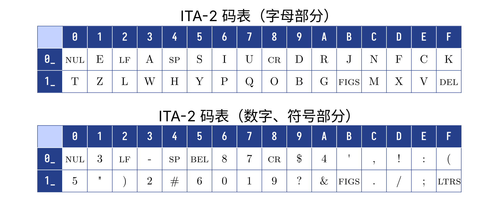
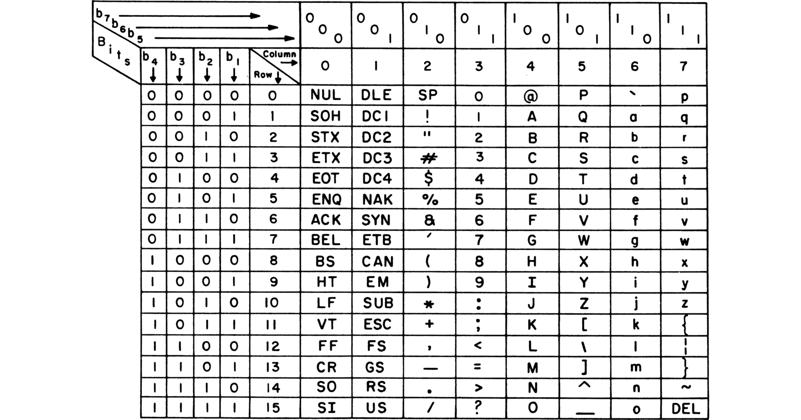
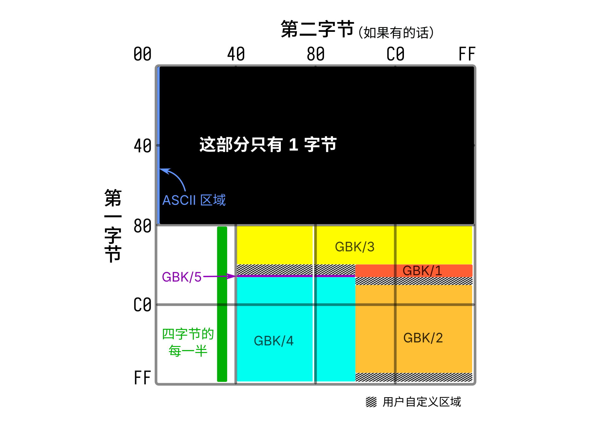

# 万言皆数——字符与编码规则


这一章让我们来一探「字符」在电脑世界中的奥秘。或许曾经有人告诉你，在数字世界中，一切不过是由 `0` 和 `1` 交替组合而成的数据罢了。那么，这些看似毫无规律的「数」，是如何和人类的万千语言对应上的呢？「编码」就是解决这一切问题的答案。看完这一章，也许你就能找到这些问题的答案：

- 二进制、十进制都是什么？「字节」又是什么？
- 世界上那么多种文字，为什么计算机能完整地表示它们？
- 为什么我在网上或一些 app 中，有时会看见各种各样的乱码？例如：
  - 浣犵己澶辩殑閭ｉ棬璁＄畻鏈鸿
  - äœ çŒºå€±çš„é‚£é—šè®¡ç®—æœºè¯Ÿ
- 在使用电脑的过程中，我们如何避免这样的乱码的产生呢？


语言文字是文化的基础要素和鲜明标志，是推动人类进步的重要力量。文字作为语言的载体，在进入信息时代后，「如何把文字在计算机系统中表示」就成为了至关重要的问题。将目光投向电脑的屏幕，这一章，我们会来看看我们使用电脑时必然会见到，却又不太明白个中奥秘的内容——屏幕上显示的文字与它背后的「数字」。

## 机器中数的表示

在了解文字与数之间的关系之前，我们有必要先简单学习一下，计算机中的「数」如何进行表示。

### 进制

所谓「进制」，本质上说的是数（shǔ）数（shù）的方式。我们从小就知道如何数数，借助 0 到 9 这 10 个阿拉伯数字，我们采用了一种「逢十进一」的数数方式：

0\rightarrow 1\rightarrow\cdots\rightarrow 9\xrightarrow{\text{进位}}10\rightarrow 11\rightarrow\cdots

「逢十进一」就是说，我们每数十个数，就要进一位，然后重新开始数十个数。这样，我们可以借助十个数字将所有自然数都表示出来，这种数数方式就是「十进制」。

如果让我们允许使用的数字变多，就可以设计出更高的进制。例如，如果让我们可以使用 0 到 9 以及 A 到 F 一共 16 个符号作为「数字」，我们就可以设计这样一种数数方式，逢十六进一：

\begin{aligned}
0\rightarrow &1\rightarrow\cdots\rightarrow 9\rightarrow A\rightarrow B\rightarrow\cdots\rightarrow F\xrightarrow{\text{进位}}10\rightarrow \\
&11\rightarrow\cdots\rightarrow19\rightarrow1A\rightarrow\cdots\rightarrow 1F\xrightarrow{\text{进位}}20\rightarrow 21\rightarrow\cdots
\end{aligned}

这种方式就被称为「十六进制」。

另一方面，如果限制我们能使用的数字的个数，也可以设计出更低的进制——极限情况下，我们让能使用的数字只留下 0 和 1，就自然会产生这样「逢二进一」的数数方式：

0\rightarrow 1\xrightarrow{\text{进位}}10\rightarrow11\xrightarrow{\text{进位}}100\rightarrow 101\rightarrow\cdots

这就是「二进制」。

如果我们把上面不同的数数方式并排列出，让数与数之间一一对齐，就能得到进制之间的转换关系，即同一个自然数在不同进制下的表示方式。

| 十进制 | 十六进制 | 二进制   |
| ------ | -------- | -------- |
| 0      | 0        | 0        |
| 1      | 1        | 1        |
| 2      | 2        | 10       |
| ...    | ...      | ...      |
| 9      | 9        | 1001     |
| 10     | A        | 1010     |
| 11     | B        | 1011     |
| ...    | ...      | ...      |
| 15     | F        | 1111     |
| 16     | 10       | 10000    |
| 17     | 11       | 10001    |
| ...    | ...      | ...      |
| 43     | 2B       | 101011   |
| ...    | ...      | ...      |
| 255    | FF       | 11111111 |
| ...    | ...      | ...      |

当然，为了计算一个数在某种进制中的表现，我们没必要像这个表一样总是从零开始数，而可以直接计算——例如，将十进制数转换为对应的二进制数，可以采用「除二取余法」。你可以自行在网上搜索这个方法的细节。

值得一提的是，由于当没有字母出现时，我们就没法从字面上看出一个数到底是用十六进制还是十进制表示了。为了避免混淆，除了在上下文中显式地说明（例如，「十六进制数 43」）之外，人们还习惯在十六进制数前面加上一个 `0x`（一个数字零和一个字母 x）来强调「这个数是十六进制的」。在后文中，我们将沿用这种标记。

### 计算机与二进制

在计算机内部，信息由电路承载，而电路总是只能处在「有电」「无电」两种状态中的一种。如果我们把「有电」记成 1，「无电」记成 0，那么计算机内的一条电路就自然而然地对应到一个二进制数上了，这样传输的一个数字称为一「比特」或一「位」（bit）。假设机器内部，有一处使用 8 根并排的电路用来传递数据，我们就称这样的数据「宽度」为 8 位或 8 比特。如果这 8 根电路在某一时刻的状态是：

| 电路 | 最高位 |      |      |      |      |      |      | 最低位 |
| ---- | ------ | ---- | ---- | ---- | ---- | ---- | ---- | ------ |
| 状态 | 无电   | 有电 | 有电 | 无电 | 无电 | 无电 | 有电 | 无电   |

它传递的数据就是二进制数 `01100010`，转换成十进制就是 98。人们把这样的一个 8 位数据称为一个「字节」（byte）。

> 一个字节能存储的最小数是二进制的 `00000000`，最大数是 `11111111`，请自行计算或利用工具计算它们对应的十进制数。

## 万言皆数

「万物皆数。」这是古希腊数学家毕达哥拉斯的信条，也是他创建的教派的信条，他们为万事万物赋予数字，而为数字赋予意义。如此想法在今天看来显然如同宗教一般神秘而虚无缥缈。但在电脑的世界中，所有的事物的的确确是内存、硬盘等等硬件中的一个个 0 与 1，「万物皆数」的观点在这里得到了淋漓尽致的展现。然而文字——人类为记录语言而创造的工具，在这「数」的世界中亦不可避免成为庞大数据的一部分，那么，电脑是如何令文字化为数字存储在其中，又如何令数字化为文字得以展现在我们眼前的呢？

### 编码——让字符有代号

古时人们传递信息，大多用文字写下，使用信件传递。但在一些特殊场合，例如需要飞速传递信息，或者在海上航行之类的的情形下，承载信息的文字就必须另辟蹊径才能传达到对方手中，这让人们开始思考如何为文字设计一种代号，来适应这些极端的情况。于是，「编码」的概念就此诞生。

彼时的编码，可以多种多样，例如旗语——使用特定的旗帜朝向组合来代表一个个字母；或者著名的摩尔斯电码——利用线与点的组合代表长短信号的序列，进而表示字母；又或者直到 20 世纪 80 年代还在广泛使用的中文电码——将汉字用四个数字或三个字母表示，再利用摩尔斯电码化为长短不一的信号……下图分别展示了国际摩尔斯电码与你可以在 1986 年用六毛钱买到的《标准电码本》中的某一页。

而接受编码的对象，可以是一个汉字、一个字母、一个标点，甚至一个「接到这个信号就表示信息发完了」的「虚拟字」。所有这些，我们给它们起了一个名字——「字符」（character）。

随着电子时代到来，0 与 1 的波浪占据了信息传递的方方面面，「编码」的含义也随之变成了「为每一个字符分配一个特定的数字以代表它」。

### ASCII——故事真正的开始

ASCII，全名「美国信息交换标准代码」（American Standard Code for Information Interchange），是美国国家标准协会（ANSI）——的前身美国标准组织（ASA）在 1963 年为改进电报编码而制定的编码规则。

> 所以 ASCII 的「II」不是罗马数字 2，也不能读成 ASK-二，而应该是 ASS-key。

20 世纪 60 年代初的美国，电报通信还是电传打字机的天下，它们遵循叫做「国际电报字母第 2 号」（ITA-2）的编码规则。但这 ITA-2 编码非常抽象，它不仅没有规律，还只有大写，要想输入数字和标点还需要特定的「虚拟字」来转换码表。后来的 TSS 编码虽然加入了小写，可其他问题一个没改。天下苦乱糟糟编码久矣，于是 ASCII 横空出世，带来了非常漂亮的编码规则。

ASCII 使用 7 位二进制数来编码字符，可以表示的数据范围是 0—127，也就意味着它能包揽英文字母（2\times26=52 个）、阿拉伯数字（10 个）、常用标点符号（二三十个），甚至还有空余。ASA 也没闲着，确实往这些剩下的空位里面塞进了许多「控制字符」，也就是上文所述的「虚拟字」。下图是 1967 年版的 ASCII 编码标准，共 7 列 16 行，「0」列与「1」列都是控制字符，用来控制通信设备；数字在「3」列，可见 `30` 就是 0，`31` 就是 1……挺方便；「4」列、「5」列有按字母表排列的大写字母，隔壁的「6」列、「7」列中相同的位置有小写字母；剩下的地方全是标点符号了。

按照这这张表，一个字符可以用两个十六进制数字表示，第一个是列数，第二个是行数。例如「Missing!」编码出来，用十六进制数表示就是 `4D697373696E6721`，看不懂没关系，机器能明白。值得一提的是，1963 年的初版 ASCII 并没有加入小写字母，而是把那一块空出来了，后来人们发现不妥，于是在初版发布的几个月后就立马加上了小写字母。如此一来，英文的文字通信需求就被这一张表完美涵盖了。

1968 年 3 月 11 日，当时的美国总统林登·约翰逊要求美国政府购买的所有电脑都必须支持 ASCII 编码，自此，ASCII 成为了事实上的编码标准，也成为了众多其他编码规则的祖先。

### 百花齐放的代码页

相信大家都知道，1 个字节由 8 个二进制数组成 ~~（如果你不知道，那么现在你知道了）~~，但 ASCII 诞生的那个年代人们还没有这个意识，这也就是为什么 ASCII 是 7 位二进制数码。1968 年，高德纳在他的《计算机程序设计艺术》第一卷中假想了叫做「MIX」的电脑，在它之中，一个「字节」应当「包含不定量的信息……能够容纳至少 64……至多 100 个不同的值……应有 6 个二进制位」。但到了 1970 年，Intel 推出了划时代的 8080 处理器，风靡全球，而它是 8 位的，于是乎「字节」一词顺理成章地逐渐变成了「8 位二进制数单元」的代名词。在此之后研发的处理器，例如 8080 的后继者——80x86 系列，它们的位数都是 8 的倍数，「字节」=「8 位二进制数单元」也变成了人们不可撼动的共识。

7 位的 ASCII 移植到 8 位实在不费吹灰之力，前面加个 `0` 就行。但是 80 年代以来，电脑随着科技革命的浪潮，散布到了世界的各个角落。与此同时，两大难题也随之而来：
- 法国有「é」，德国有「üß」，俄罗斯有「иящ」，日本有「あいう」，中国有「天地人」……大家都需要在电脑上显示自己的文字，那怎么办呢？
- 像法国、德国等西欧国家，使用的字母相比英语而言只多那么有限的几个，ASCII 只占了 128 个位置，8 位的字节可支持 256 个位置，只要在剩下的空格里加上所需的就可以了。然而世界其他地方的国家就没这么好说了，中文甚至有成千上万的汉字，显然不是简简单单就能塞得下的。对于这些有大量额外内容的文字，又该如何制定合适的编码规则以容纳它们呢？

一个简单的想法是，把大伙用到的字符全收集起来，然后统一编码即可。可惜想法很美好，技术与钱包不同意。1985 年，普通个人电脑的硬盘大约只有 10 MB 的容量，却要花高达 250 美元才能买到，寸土寸金的硬盘空间让人们只能寻求替代方案。于是，为了解决这些问题，IBM 与微软一起，在 DOS 3.3 版本时推出了全新的全球化功能——代码页（code page）。

代码页的思想是，将各种不同的文字系统赋予一个数字代号，操作系统识别这个数字代号，就知道当前应当是哪种语言、使用什么文字编码。IBM 与微软主要负责为各种文字系统指定代号，而为文字编码，则交给各个国家与地区的机构完成。不过，一种语言可能有很多编码，一种编码也可以由多种语言使用，所以事实上，代码页和编码规则是一一对应的。下表是最初的部分代码页/语言/编码规范对应表。[^codepage]

[^codepage]: 虽然 819 和 1252 是不一样的代码页，但网页显示会把 819 视作 1252 来解析。

| 代码页 |   语言   |                             编码规范                             |
| :----: | :------: | :--------------------------------------------------------------: |
|   38   | 美国英语 |                             US-ASCII                             |
|  819   | （多种） |     ISO 8859-1:1998 8 位单字节编码字符集——拉丁字母：第 1 号      |
|  932   |   日语   | JIS X 0208 7 位及 8 位双字节信息交换用符号化汉字集合[^shift-jis] |
|  936   | 简体中文 |          GB/T 2312-1980 信息交换用汉字编码字符集 基本集          |
|  950   | 繁体中文 |                              大五码                              |
|  1252  | （多种） |                         WHATWG 编码规范                          |

[^shift-jis]: 又称 Shift-JIS。

如此一来，第一个问题解决了，世界各地的电脑可以通过代码页来决定使用什么编码规范了。但第二个问题呢？让我们翻开手边的《GB/T 2312-1980 信息交换用汉字编码字符集 基本集》（以后简称「GB2312」）来看一看。这是我国的国家标准之一，其中收录了 6763 个最常用的汉字，能够满足绝大多数情况下的日常使用。为了排布那 6763 个汉字，以及额外收录的希腊字母、西里尔字母、注音符号、日文假名等内容，GB2312 不再局限于单个字节，而使用了「区位码」的方法——先将码表分为 94 个「区」，每个区中又有 94「位」，这样总共94 \times 94 = 8836个位置——或者说「码位」，足够容纳下这么多字符了。整个标准中，1~9 区放字母与符号，16~87 区放汉字，剩下的没用到。下图展示了第 16 区容纳的内容。

占了 87 个区的这些内容，可以用两个字节来分别表示，一个标识区、一个标识位。但是 GB2312 并没有规定区位码和编码字节值一定要一样，于是在实际实现中，为了不和 ASCII 打架，区码就使用了 `A1`~`F7` 的 87 个十六进制数，位码使用了 `A1`~`FE` 的 94 个十六进制数。例如上图中的「凹」字，位于 16 区 28 位，那么它的编码就是 `B0BC`。这样，整个编码体系就建立完成了。

目前看来一切都还不错，直到人们发现 GB2312 漏掉了一些经常使用的字，例如在「啰嗦」这个常用词中的「啰」，以及许多人名字中的生僻字，例如「镕」。一方面，人们为了能够显示出这些字，使用了一系列替代方案，比如拼字或者换专用字体：


「少口罗嗦！」方镕打断道。


另一方面，人们也在推动更多字符被收进编码体系中。经历了十几年的努力，1995 年，《汉字内码扩展规范》发布，通称「GBK」，意为「国标扩」，收录汉字的总量达到了 21003，代替了 GB2312 在代码页 936 中的位置。它在双字节中没有用上的很大一部分都塞上了汉字，如下图「GBK」部分所示，其中「GBK/1」「GBK/2」部分就是 GB2312。而为了避免与 ASCII 相冲突，GBK 仅使用 `80` 及以上的值作为双字节编码开头。

然而 GBK 并不是一个纸面上的国家标准，而只是一个被人们广泛采用而造就的「事实标准」。于是又过了几年，在 GBK 的基础上，国家标准委员会推出了《GB 18030-2000 信息技术 信息交换用汉字编码字符集 基本集的扩充》，收录了 27533 个汉字，其中包括许多繁体字与生僻字。为了收录这么多汉字，标准增加了四字节编码的部分：四字节由两个特定的双字节构成，如上图绿色部分所示，那一块一共 1260 个码位，可以表示1260^2 = 1\,587\,600个字符。~~（根本用不完，哈！）~~ 自此，更多的中文字符被官方标准的编码体系所囊括，除了极为生僻的古文用字，几乎不会有「缺字」的情况出现了。

之后二十来年，国家不断修订这个标准，目前最新的修订版是《GB 18030-2022 信息技术 中文编码字符集》，不仅收录了 87887 个汉字，更收录了朝鲜文、蒙古文、藏文等我国许多少数民族使用的文字，成为了我国各民族都可使用的通用标准。以下是一些文字在 GB18030 最新版中的编码对应关系。

| 文字  | 编码       |
| :---: | :--------- |
|  绝   | `BEF8`     |
|  𪩘   | `9836CF34` |
|  랓   | `8239FB38` |
|   དྷ   | `8132F036` |

通过对中文编码的一瞥，我们已经领会了如何给拥有巨大文字量的文字系统编码，其他文字系统的代码页也是相似的思想。而且几乎所有的代码页都不约而同地将 ASCII 的部分留了下来，令 ASCII 编码的内容无论以何种代码页解析都能得到正确的结果，这也就是为什么我们说「ASCII 是众多其他编码规则的祖先」。不同的代码页服务着世界各地讲不同语言、使用不同文字的电脑用户，让所有人都能享受到信息时代带来的便利与乐趣。

但转念一想，「代码页」的工作方式，似乎将重点放在了「决定这个代码页中含有哪些文字」，在确定了这些事之后，才去思考、制定对应的编码规则。所以，「代码页」的本质应当是一种「字符集」（character set）——首先是一系列特定字符的集合，然后是与之对应的编码方式。

### Unicode 与 UTF 的大一统时代