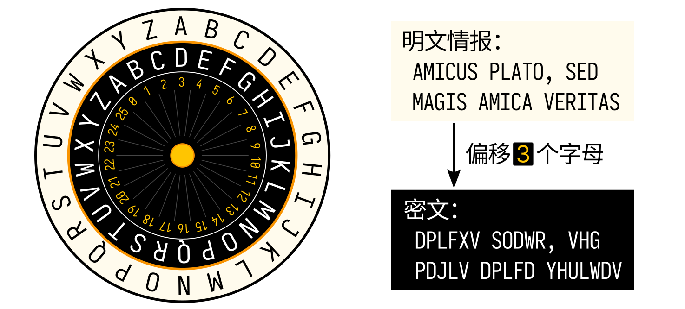
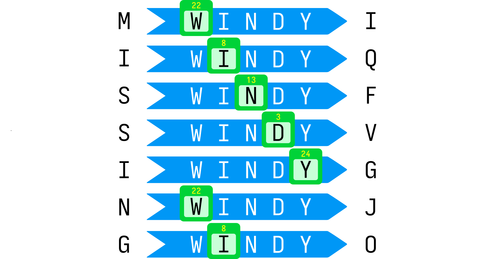
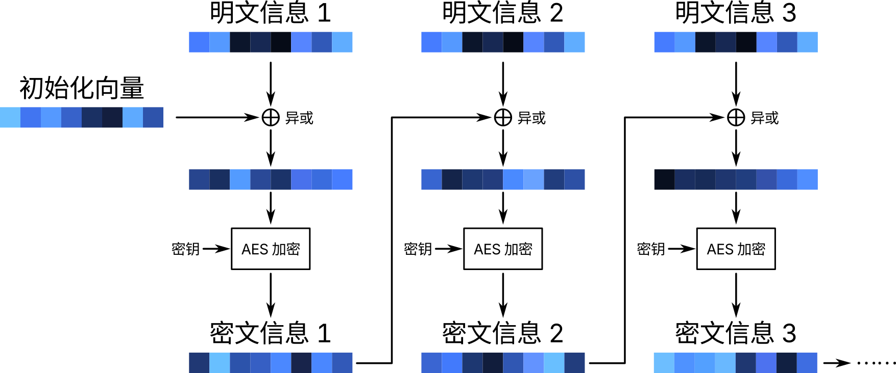

# 以密码之剑护网安之城


🚧本章仍在施工中，内容并不完整且会发生变化，仅供先行阅读参考。



在网络越来越发达的今天，网络安全早已成为国家安全的头等大事之一。但这份「安全」，要靠人类不断发展与精进的密码学来守护。这一章，我们来走进密码学的世界，探寻数字与文字间的舞蹈，以及密码如何守护网络世界的安全。读完本章，你应该有了下面这些问题的答案：

- 为什么网络世界中危机四伏？
- 什么是「密码」，它和我们平常使用的「登录密码」有何联系？
- 从古至今，世上有哪些有代表性的密码？
- 「HTTPS」是什么？为什么有时浏览器会提示「网站不安全」？
- 当今的密码如何保证我们的信息在网络中完整与安全？



今天的世界已经离不开网络，从我们的日常生活到政府各项事务的管理，从企业的高效运转到顶尖的科学技术，网络已经成为了这一切的基石。可是你是否想过，这个网络世界其实「危机四伏」？我们在网络上传输的信息，可以很轻易地遭到拦截和篡改；在企业与企业之间，甚至国与国之间，网络已经成为「没有硝烟的战场」。这样的环境之下，密码学技术帮助人们保护信息的安全，而以密码学为武器，人们构建起了网络安全之「城」，进而造就了今天绚丽多彩的网络世界。

## 危机四伏的网络世界

网络世界之所以「危机四伏」，从某种意义上来说，和当今互联网的底层技术——「分组交换」——脱不了干系。

我们说网络连接了世界的每一个角落，但这么多角落都依靠「点对点」的直接连接显然不太现实。事实上，网络之所以称为「网络」，正是因为它如同我们不时见到的蜘蛛网一样，由许多「结点」张成，信息在结点之间进行「转发」。今天，我们可以使用网络与远在地球另一端的朋友交流，并不是因为我们之间用一根无比长的网线牵着，而是因为我们之间有许许多多相互连接的结点，它们在我们之间搭成了一条「通路」。

为了提升信息在结点之间传输的效率，网络会将我们需要发送的数据「切」成许多一定长度的小片段，这些片段就像一个个快递包裹一样，流入一个个结点。每个结点如同快递的转运中心，会根据片段上标记的「目的地」信息，将片段转发给去往目的地的下一个结点。就这样，经过一次次转发，我们的数据片段最后都会抵达终点，并重新组装为完整的数据。这种传输方式称为「分组交换」，它奠定了互联网的传输基础。

然而，看似十分完美的过程，实际上充满危机。在网络上传输的数据可以很轻易地被截获，甚至直接修改也不是什么难事。攻击者只要攻击、控制了网络中的一个结点，所有经过它的数据片段都一览无余。如此一来，攻击者可以随意篡改数据片段的内容，使得最终发送到目的地的数据大相径庭；或者将数据「拦下」，让目的地收到不完整的信息，甚至完全收不到数据。攻击者甚至可以伪造我们的名字，以我们的名义发送伪造的信息，从而造成具有破坏性的后果。

如果我们能将数据「加密」，使得加密后的信息即使被截获，攻击者也无法得知其中内容，就能在一定程度上解决这个问题。若是还可以设计出校验信息完整性、真实性的方法，传输的安全性又能再跃上一个台阶。随着密码技术的发展，这一切都渐渐成为了可能——接下来，让我们推开密码世界的大门，领略今天的「密码之剑」如何铸成。

## 蓬勃发展的密码学

### 人类的「传统艺能」

<p style="font-size: 6px; font-weight: 100; color: lightgray; text-align-last:justify; margin: -4px">S t e g a n o g r a p h y</p>
几千年来，人类的交锋见证了密码学的发展，从古代战场间的传令、军中机要情报的转移、能工巧匠家里的祖传秘方，到如今网络世界的信息流转……种种危机四伏的场景，如何让这些重要信息不被不相关的人员所知晓，便是这种「仅有我认识」的文字技艺的用武之地了。跨越几千年的时间长河，我们从头来看「密码」的力量如何铸就诸多信息的安全无虞。

让我们首先把目光投向密码学的孪生兄弟——「隐写术」（steganography）。「隐写术」，顾名思义，就是把重要信息「隐藏着写下来」，让读它的人基本不会注意到重要信息的手段。虽然它不算一种密码，但在「使信息对不知道的人来说很难看出来」这方面，它和密码是一样的。

古罗马的古典诗人奥维德就曾记录过用新鲜牛奶写信的隐写术——这样写在纸上的字很快就会消失不见，但是如果点燃字迹的一角，就可以将字迹显现出来。除了牛奶外，一些植物汁液、明矾、果汁等也被用作隐形墨水。另外一些隐写术则和今天学生的小抄有些类似——将信息写在树叶上、衣服里或是身体上，再运用多种方法进行遮掩。还有一些，隐藏在文字的字里行间，例如藏头诗，或将句子中每个单词的第一个字母连字成句……可无论如何，只要你能看到隐藏的信息，你就能读懂它，这也是隐写术的特点——明文隐写。

虽然一直以来，隐写术都是非常基础的信息隐藏技术，但在现代的电子显示设备上，为了解谜游戏的谜题，或为了实现某些特殊的效果，隐写术焕发了第二春。譬如本节的开头就藏着小小的一行「Steganography」，除此之外，信息文本可以是透明的，也可以藏在网页背后的代码之中……<span style="color: rgba(0,0,0,0)">比如这</span>

与隐写术相比，密码学（cryptography）的目标，则是将内容「变换」，使之变成常人看不懂的模样。这样的技术称为「密码」（cipher），而对应的学科称为「密码学」。公元前 5 世纪，古代的斯巴达人使用过一种叫做「密码棒」（Scytale）的器械，就是一根上面缠绕有羊皮纸条儿的木棍。人们把信息竖着写在羊皮纸条儿上，写完后从木棍上取下，原本的字母顺序就被打乱，难以再看出原本的信息。需要阅读时，只需取一根同样规格的木棍，将羊皮纸重新缠绕即可。这种密码棒是人类历史上已知的最早的密码器械。


> 所以「密码」一词指的是将信息进行变换以进行保密的技术。而我们在生活中经常说的 **「登录密码」「开机密码」，虽然也叫「密码」，但是含义并不相同，它们的学名叫「口令」**。

古罗马的凯撒大帝使用过这样一种方法来保护重要的军事信息：将每个字母向后移动 3 位。如下图所示，左侧是一个加密轮盘，外圈的明文与内圈的密文一一对应，当前正对着明文 A 的是 3，也就是偏移 3 位的状态。将右侧的明文情报按左侧的对应关系转换过来，就得到了看不懂的密文。



若不知道这种方式的具体细节——甚至，即使知道它采用了移动字母的方式，如果不知道具体的偏移数字，他人就很难从后面这个句子猜出原本的内容。这种密码被称为「凯撒密码」。事实上，凯撒密码不止局限于「3」这一个偏移量，0 到 25，你可以选择你喜欢的，只要把轮盘转到对应的位置就好。

在这些例子中，原始信息称为「明文」，经过处理后，难以理解的信息被称为「密文」。将明文转换为密文的过程称为「加密」，而反过来就是「解密」。为了完成这两个过程，我们需要用到额外信息——「密钥」，它就像一把钥匙，加密与解密都是需要它来打开的门扉。例如，对于密码棒来说，秘钥是密码棒的尺寸；对于凯撒密码，密钥就是它的偏移量——3 这个数字。

然而实际上凯撒密码非常容易破解，即便你不知道密码的偏移量，英文就那么 26 个字母，一个个试都能试出正确的秘钥。所以，人们不再局限于往一个方向偏移，而发明了「字母替换密码」。字母替换密码就相当于重排字母表，将每个字母替换成另一个字母，例如：

```text
原文：ABCDEFGHIJKLMNOPQRSTUVWXYZ
密文：QWERTYUIOPASDFGHJKLZXCVBNM
```

这样一来，「MISSING」一词加密之后就变成了「DOLLOFU」。相比凯撒密码，字母替换密码更隐藏了字母之间的相对位置关系，而高达26!种加密情况也使得它更难被暴力破解。然而，人们统计了大量文本，发现英语这样的字母语言中，每个字母在文本里出现的频率是有规律的：譬如 E 与 T 是在英语中出现频率最大的两个字母。那么，在我们收集了足够的密文之后，其中出现频率最大的两个字母，就很可能对应着 E 和 T。这就是「频率分析」的威力，靠这样的分析，人们就可以确定字母间的对应关系，从而破解字母替换密码。

于是，又从凯撒密码出发，人们发明了一种有趣的加密方式——维吉尼亚密码。在凯撒密码中，每个字母前后推动的距离是固定的，而维吉尼亚密码通过构建一个「密码表」，将这一距离动态化，增加了破译的难度。

维吉尼亚密码的「密码表」靠字母建立。在凯撒密码中，每一个特定的偏移量下，A 都会对应不同的字母，那么反过来，可以用与 A 对应的字母来指示偏移量，例如 D 就代表偏移量为 3。下图展示了用「WINDY」加密「MISSING」的过程，可见，每一次的偏移量都在变化，这样一来，若不知道密钥，就很难破解密文。



密码学伴随着人们保密意识的产生而诞生，然而直到 20 世纪 50 年代，密码学的本质都没有什么变化。各种加密方式都可以归类为「代换」和「置换」两种变换或它们的组合：「代换」指的是「用一种字母替代另一种字母」，而「置换」指的是「变更不同字母的位置」。上文提到的密码棒就是一种置换密码，而凯撒密码及其衍生版本则是代换密码。

在这一时期，密码的安全性，来源于代换和置换的精巧设计；而这样的设计，或基于经验，或基于直觉。因此，此时的密码学更像是一门「艺术」——比起严格的论证，它更侧重人类头脑中的灵光一闪。同时，这些密码大多可以通过频率分析的方法破解。如今，我们把这整个时期的密码学都称为「古典密码学」，而相关的密码则称为「古典密码」。

1949 年，美国数学家、工程师香农的《保密系统通信理论》（*Communication Theory of Secrecy Systems*）从数学和信息论的角度阐明了关于密码系统的分析、评价和设计的科学思想，提出了有关密码学的完整数学模型。简单来说，这篇论文用数学的语言，定量地描述了密码的「安全性」，以及与其相关的一系列概念，如密钥的复杂度、加密的复杂性等等。它让密码从一门基于感性构造、精巧设计的「艺术」，开始走向基于理论分析、实验验证的「科学」。

自此，密码学的发展有了理论的指导，密码学开始从人类的「传统艺能」向科学转变，近代密码学的序幕就此拉开。

### 对称密码的发展

#### 一把钥匙开一把锁

第二次世界大战期间，纳粹德国使用一种被称为「恩尼格玛」（Enigma，意为「谜」）的密码机来加密军事通讯。这种密码机形如一台打字机，只不过它没法装纸，也不能在纸上打字；相反，它有一个由 26 盏小灯泡组成的显示板，排布就如下方的键盘一般。此外，在机器上方，它还装有几个印有字母的机械转盘（称为转子）。下方左侧就是一种常见型号的恩尼格玛密码机的示意图。当使用者在键盘上击键时，某个不同字母[^enigma]对应的小灯就会亮起——这便是对应字母加密后的密文。

[^enigma]: 没错，这正是恩尼格玛密码机的特点之一：加密后的字母绝不与原始字母相同。你可以在阅读下面的介绍后思考一下这是为什么。


上方右图展示了恩尼格玛密码机大致的工作原理。每 <u>➊ 按下一个键</u>，<u>➋ 转子就转动一格</u>。转子之间有联动机构——当一个转子转完一圈后，它左边的转子也会转一格。同时，按下的键发出一个电信号，并首先被传到「接线板」，在这里分布着对接到不同字母的插孔，使用者可以 <u>➌ 插上一些「跳线」，将信号在连接的字母间对换</u>。紧接着，<u>➍ 电信号进入第一个转子</u>。不同的转子内部会按各自的规则替换字母，使用者可以按需选用不同型号的转子。<u>➎ 信号依次流过三个转子，并在折返后再反向流回去。</u>此时，电信号代表的字母已经和原来按下的字母相去甚远了。最后，<u>➏ 信号再被送入接线板</u>进行 <u>➐ 最后一次替换</u>，然后 <u>➑ 点亮对应字母的灯泡</u>。

> 上节介绍了「明文」「密文」「密钥」的概念，那么恩尼格玛密码机的明文、密文和密钥是什么？
 
在这样的一整个流程中，字母一共经过了 8 次替换，而且由于转子随每次击键而旋转，这种替换关系每输入一个字母就会变化，使得字母之间的对应关系变得极其复杂，最终的密文与原文看起来毫无联系。但解密却很简单，只需要在另一台相同型号的密码机上安装相同的转盘，调整到相同的起始位置，并以相同方式连接跳线，输入密文，即可打出原始的明文。

二战前期，德军在战场上节节胜利，一定程度上依靠了恩尼格玛密码机强力的加密效果，让他们顺利隐藏自己的情报与动向。然而，盟军方面却为破解恩尼格玛密码机付出了不少努力。

事实上早在 20 世纪 20 年代，德国已经开始使用恩尼格玛密码机。1927 年，英国方面买了一台商用恩尼格玛密码机，这种机子没有接线板。花了十年终于成功破解，但可惜没法用在军用机上。而同期波兰的研究者依靠对德语的了解与一些间谍活动，初步破解了三转子的军用密码机。二战期间，盟军基于这些成果，外加一些德军的疏漏，才成功破解恩尼格玛密码机，并逐步扭转战局。

> 据说在热门网络游戏《第五人格》中，玩家需要破译的「密码机」，设计原型就是恩尼格玛密码机。

无论是凯撒密码还是恩尼格玛密码机，它们都有一个共同的特征：**加密和解密过程使用相同的密钥**。解密凯撒密码，只需加密时使用的偏移量即可；而对于恩尼格玛密码机，则需要知道加密时使用的转子型号、转子起始位置以及跳线连接情况。这样的密码被称为「对称密码」，如同现实生活中的钥匙和锁一样，我们使用同样的钥匙来上锁和开锁。对称密码是最基本的一种密码形式，它符合我们对「加密」这件事的直觉，因此当密码学从古典时期迈向近代时，人们首先研究的，便是如何设计出安全、高效的对称密码。

#### 混淆与扩散

前文我们提到，古典密码的设计模式，总可以分成「代换」和「置换」两类。前者替换内容，后者更改位置。在近代密码学中，人们从信息论的角度对这两类方式进行了概括和发展，代换与置换法随之进化为「混淆」和「扩散」。

- 「混淆」旨在掩盖密文和明文之间的对应关系，最简单的方式是代换。增强混淆效果则需要设计更加复杂的变换方式。恩尼格玛密码机通过多个旋转转盘改变字母映射，其实亦是一种混淆。
- 「扩散」的目的是将单个字母加密所带来的影响扩大——譬如，加密一个字母，可能会改变密文中多个字母的表示。置换是扩散的最简单方式，但能力非常有限——只能影响某处单单一个字母。而现如今使用的各种对称加密算法，都能做到「原文改变一点点，密文改变一大片」。

优秀的密码算法，就是科学地结合混淆和扩散，实现最大的安全性。顺着这样的思路，我们介绍两款在密码学历史上具有重要意义的对称加密算法：曾经风光无限但已寿终正寝的 DES，以及今天正在广泛使用的 AES。

#### 数据加密标准（DES）

20 世纪 70 年代，随着美国政府开始重视计算机安全问题，美国国家标准局（NBS，现为美国国家标准与技术研究院 NIST）开始征集用于政府内信息加密的算法。最终，IBM 公司提出的一套算法得到采用，NBS 为它赋予「数据加密标准」（Data Encryption Standard，简称 DES）的名字并正式公布。DES 算法采用了一种「分组加密」的思路——将明文先切割成固定 64 位长的块，再逐块加密，块与块之间的加密可以互相影响，这些块的密文最终合成为一条完整的密文。解密时，只需反向切割密文，再逐块解密即可。

> 在本章后续的介绍中，「位」均指「二进制位」，比如「64 位的明文」指明文由 64 位二进制数（即「比特（bit）」）组成。

而 DES 对每一块加密时，都会使用 56 位长度的密钥来**循环进行 16 次包含代换和置换的操作**。其中的代换部分，DES 使用一套预先设计好的代换表——「S 盒」施行。下表就是其中一个 S 盒，若向它输入数据 46，先转换为十六进制 `2E`，再寻找第 `2` 行第 `E` 列的值，就能得到代换后的结果 `B`，即 11。DES 一共有 8 个这样的 S 盒： S_1 至 S_8，它们互不相同，每个都是经过特定设计得到的，可以在加密过程中引入复杂性来防止被轻易破解。

|     | _0  | _1  | _2  | _3 | _4 | _5 | _6 | _7 | _8 | _9 | _A | _B | _C | _D | _E | _F |
| :-: | :-: | :-: | :-: |:-: | :-: | :-: | :-: | :-: | :-: | :-: | :-: | :-: | :-: | :-: | :-: | :-: |
| **0_**   | E   | 0   | 4   | F   | D   | 7   | 1   | 4   | 2   | E   | F   | 2   | B   | D   | 8   | 1   |
| **1_**   | 3   | A   | A   | 6   | 6   | C   | C   | B   | 5   | 9   | 9   | 5   | 0   | 3   | 7   | 8   |
| **2_**   | 4   | F   | 1   | C   | E   | 8   | 8   | 2   | D   | 4   | 6   | 9   | 2   | 1   | B   | 7   |
| **3_**   | F   | 5   | C   | B   | 9   | 3   | 7   | E   | 3   | A   | A   | 0   | 5   | 6   | 0   | D   |

> 想知道 DES 的具体过程？受限于篇幅和本文的定位，我们在此处不作过多介绍，你可以自己上网搜索。
>

1975 年，DES 正式对外公布，并在 1976 年被定为美国联邦标准。DES 的提出，在密码学历史上具有里程碑式的意义。DES 公开后，没过几年就成为了世界上使用最为广泛的加密算法：美国政府使用 DES 存储重要信息，大型企业使用 DES 保护商业秘密，美国银行业将 DES 作为批发银行业标准……另一方面，DES 所使用的分组加密思想、费斯妥结构和密钥扩展等思路，启发着无数后继加密算法的研究。

然而，有关 DES 算法本身的争论从它诞生开始就没有停息。围绕 DES 算法本身，争论的焦点有两个，其一便是 56 位的密钥是否足够安全。任何密码都存在通过穷举所有可能的密钥来破解的可能，这就是「暴力破解」。而实际破解的难度会随着算力的发展快速下降：在 1977 年——也就是 DES 成为联邦标准的次年——就有学者构想了一台造价 2000 万美元，可以在 1 天内暴力破解 DES 密码的机器。到了 1993 年，同类机器的理论成本降到了 100 万美元，时间缩短到 7 小时。而在 1998 年，一台造价只有 25 万美元的破解机器被实际造出，从此破解 DES 成为事实上的可能。除了暴力破解外，一系列更高效的破解算法亦于上世纪末出现，它们让 DES 从「安全无比」的神坛上跌落，向人们昭示着密钥长度的重要性。

而有关 DES 的另一个争论，便是其神秘的 S 盒设计。我们刚才提到，DES 一共使用了 8 个 S 盒执行代换，而它们是人为设计并公开给大众使用的——那么，为什么这些 S 盒要这样设计呢？它们是否真的足够「安全」？尽管 S 盒的设计声称安全无比，并能防御多种破解方式，但是这些设计是否存在不为人知的甚至是**刻意留下的**漏洞呢？由于 IBM 并没有完全公开 S 盒的设计方法，这些问题变成了悬在人们头上的利剑，而执剑人则隐藏在黑暗之中。人们开始思考，能否让 S 盒的构造方式变得透明，同时仍然保持足够的安全。

基于各种安全原因，1999 年，DES 被要求「只能在遗留系统中使用」，新的系统必须使用 DES 的升级版——三重 DES（Triple DES，简称 TDES 或 3DES），即利用两个密钥进行 3 次 DES 加密。然而这只是「换汤不换药，治标不治本」罢了。2005 年，美国官方不再使用 3DES，但 NIST 仍然保留了 3DES 作为可选标准。2018 年，NIST「退役」3DES，从此 3DES 只能在老旧的系统中使用，各种软件纷纷开始移除对 3DES 的支持。

2023 年 6 月，NIST 发布公告，宣布将于 2024 年 1 月 1 日起，正式废止有关 3DES 的使用建议，这标志着美国完全抛弃 3DES。而各地的软件厂商亦已用更安全的加密算法完全替代它，属于 DES 的时代画上了句号，它的后继者——高级加密标准（Advanced Encryption Standard，简称 AES）则在今天继续守护着我们的安全。


#### 高级加密标准（AES）

在上世纪末 DES 被证明不再安全之际，人们除了「亡羊补牢」式地急忙提出 3DES 算法外，亦开始寻找新的更安全的加密算法。1997 年，NIST 开始为「高级加密标准」（AES）征集加密算法。在经过数年的甄选后， 2001 年，由比利时密码学家 Joan Daemen 和 Vincent Rijmen 所设计的一款算法脱颖而出，成功拿下 AES 的名号。自此，DES 系列算法渐渐走向历史的坟茔，而 AES 直到今天仍然是最广泛使用的对称加密算法，并且依然有着无与伦比的安全性。

和 DES 一样，AES 也是一种分组密码，不过分组长度为 128 位。AES 同样采用了代换置换结合的方式完成一轮加密操作，亦通过多次循环来确保安全性。不过，AES 使用的结构与 DES 有所不同，密钥长度也不一样：AES 可以选择 128 位、192 位和 256 位三种不同长度的密钥，远远长于 DES 的 56 位，显然也更加安全。同时，相比于 DES 的 S 盒采用的人工设计法，AES 使用一个神奇的数学方法来生成 S 盒，因此其安全性可以严谨证明，不存在刻意留下漏洞的空间。

> AES 的 S 盒，本质是在有限域 GF(2^8) 上对素多项式 m(x) = x^8 + x^4 + x^3 + x + 1 求逆。
>

AES 优秀的算法设计使其一直保持着足够的安全性。直到今天，人们仍然没有发现破解 AES 的实用方法。自 2002 年 NIST 将 AES 订立为标准以来，AES 已经成为了最流行的对称加密算法，在我们的生活中几乎无处不在。例如，你正在浏览的《你缺计课》网站本身，利用了 HTTPS 技术（详见后文）传输到你的眼前，其间就依靠 AES 加密来保证安全；在我们的手机、电脑内部，操作系统亦大量使用 AES 来加密存储敏感数据，防止设备失窃后的隐私泄露。

### 非对称密码的兴起

#### 令人头疼的密钥交换

对称密码的不断发展，让数字时代资料的保密存储成为了现实。然而，无论是 DES、3DES 还是 AES，这些对称密码在用于数据传输时都有一个问题：加密和解密用的密钥，如何安全地在双方之间共享呢？

或许你会说，只要提前将密钥发送给对方就行了。但是请别忘记，我们之所以要加密通信，正是因为通信环境不安全——在本章开头我们就提到，网络世界「危机四伏」。所以，提前将密钥发送给对方，就有可能造成非常严重的后果——我们的「钥匙」可能遭到恶意拦截、伪造甚至调包，让之后的一切加密都形同虚设。你也许还会想到，能否通过安全的物理手段——比如，线下碰个面——来提前沟通密钥呢？某些情况下似乎可行，但如果通信双方是未曾谋面的陌生人，恐怕就不太方便了。如此一来，寻找一种**不需要提前共享相同密钥，就能实现加密通信**的方式，成为了摆在我们面前的现实问题。

我们想象一个现实的场景。在那交通还不发达的古代，小明和小红相隔千里。现在，小明（发信方）要将一则非常重要的机密信息用鸡毛信的方式传递给小红（收信方）。由于路途漫长，信件在传递过程中几易其手，很难保证不被好事之人窥探。为了保证信息的安全，他们想到了一个这样的方法：

- 首先，小红制作一个带锁的信封。这种锁和我们日常生活中用的门锁类似，锁上后需要用钥匙打开，但是开锁后用力一扣就能锁住，无需钥匙。
- 接着，小红先把这个信封上的锁打开，将信封寄给小明，但钥匙留在自己手上。
- 小明收到信封之后，把需要寄出的机要信息装进信封，用力一扣——现在，信封被锁住，除了小红以外的任何人都无法打开它了。
- 最后，小明把这个装好信件的上锁信封寄给小红。小红收到后，用自己手里的钥匙将信封打开，取出信息。

就像这样：


在这样的过程中，通信双方之间并没有提前交换过任何「钥匙」，只要锁本身足够安全，就可以确保只有小红自己能取出信件，而负责发信的小明并不接触钥匙。当小红要回复一则消息给小明时，也只需先让小明也做一个同类的信封，再对称地走一遍同样的流程即可。

我们可以看到，在这套不用提前交换钥匙就能实现双向保密的过程中，「带锁的信封」是关键，它有一个重要的「非对称」性质：上锁只需要用力扣上，而开锁需要使用钥匙。将这个过程类比到加密、解密的过程，我们自然而然地想到——如果能设计一种加密和解密使用两把不同密钥的加密算法，不就可以完美地解决本节开头提到的那个问题了吗？

不妨类比「带锁信封」来构想这样一种加密算法：为明文加密要使用密钥 P，但是解密密文则要使用密钥 S。小明需要向小红安全地发送一则消息，只需要先让小红准备一对这样的 P 和 S。小红将密钥 S 保留在手中，将密钥 P 发送给小明——不必考虑安全与否，甚至直接将密钥 P 公之于天下也行。小明看到后，将手中的消息使用小红的密钥 P 加密，再将密文直接发送给小红。现在，只有小红手里的密钥 S 能解开这则密文，而密钥 S 始终留在小红自己的手里。信息被安全地传输，而用于解密的密钥全程未接触到外界。

由于密钥 P 由小红主动公开，我们称为「公钥」；密钥 S 始终留在小红自己手里，我们称为「私钥」。公钥用于将明文加密成密文，而私钥用于解密。小红持有的公钥和私钥，只能用在别人向她发送消息时，因此，通信各方都需要准备一对自己的公钥和私钥，并将自己的公钥公开给他人。这样的加密方式被称为「公钥密码」；又由于公钥、私钥的非对称性，也称「非对称密码」。

（这里需要一张图）

这个系统看起来完美得不得了，只不过有一个小小的问题——这样神奇的加密算法真的能存在吗？还真别说，真就给人们找出来几个。

#### 单向函数、陷门与公钥加密

先来做两个数学题：

1. 计算 97\times 47 的值；
2. 已知两个质数 p 和 q 满足 p\times q=4559，求 p 和 q。

如果你真去算了两道题的结果，就会发现它们互为答案，并且各自是对方唯一的答案。然而，做这两道题的难度，则完全不在一个水平：第一题只需要简单的竖式乘法就能算出来，或许你还可以直接口算甚至心算；但对于第二题，如果没有第一题的铺垫，除了从 2 开始逐个尝试所有质数，似乎没有什么好方法了。可以想象，当 p 和 q 极其巨大时，就连计算机也很难解开问题 2。同时，问题 1 的乘法计算依然能高效地解决。若将这样的运算视为函数，它们就是一种「单向函数」。顾名思义，「单向」说明这样的函数正着算很容易，倒着算很难。

现在，我们在问题 2 的基础上提供一点儿提示，让它变成如下的问题 3:

3. 已知两个质数 p 和 q 满足 p\times q=4559，且 p=97，求 q。

问题就变得十分简单，只需要进行一次除法运算，就能得到需要的结果。额外提供的提示（p=97）并不是完整的最终答案，但在提供这个信息后，通向答案的路就从「山重水复疑无路」变成「柳暗花明又一村」了。像问题 2 这样「给点提示就能行」的单向函数称为「陷门函数」（trapdoor function），它们的反向计算过程仿佛在黑暗的地下室摸索前行，毫无头绪而极其困难；但如果用一些秘密信息，为我们提供一个「活板门」（trapdoor）出口，我们就能通过它爬出地下室，让计算顺利进行。

我们生活中常用的门锁也能算一个陷门函数。在开锁状态下，我们可以用力一扣就将它上锁——这如同陷门函数的正向过程。而如果使用蛮力，就很难将锁打开——这是陷门函数的反向过程。「钥匙」则是用来填充陷门的秘密信息，将钥匙插入锁芯，门锁就能轻松打开。

钥匙、锁……等等！这不就是在我们在上一节想象的那个小明和小红的例子中用到的东西吗！自然而然，我们马上联想到，陷门函数这样的性质，可以作为设计公钥密码的基础：用公钥加密的过程，就是陷门函数的正向过程，亦是上锁的过程；用私钥解密的过程，就是陷门函数的反向过程，对应开锁的过程。上世纪 70 年代，在这种思想的启发下，公钥加密经历了从提出到实现的飞跃，密码学从此翻开了新的一页，进入了现代时期。

#### 大数分解困难问题与 RSA 加密算法

上一小节中，我们给出了一个非常简单的单向函数——质数乘法。虽然看着就不怎么靠谱，但当两个乘数非常大时，以目前的技术水平，在**有意义的时间**内将乘积分解是几乎不可能的。人们把「分解特别大的乘积」这样一个问题，称为大数分解困难问题。

> 我们早已知道，在密码学中，任何密码都可以通过暴力破解法一个个试出来，只是时间长短问题。但是，如果某个密码破解要 100 万年，那么这样的破解就没有实际意义。又如，某个信息的时效就只有 30 天，30 天后它就不再重要了，而破解它需要 40 天，这样的破解也没有意义。
>

1977 年，在麻省理工学院工作的罗纳德·李维斯特（Ron **R**ivest）、阿迪·萨莫尔（Adi **S**hamir）和伦纳德·阿德曼（Leonard **A**dleman）以大数分解困难问题为基础，设计了一款公钥加密算法，用三人的姓的首字母命名为 RSA，随后被各种领域大量使用，直到今天。RSA 是第一个得到广泛应用的非对称加密算法，在密码学的历史上亦是一座里程碑。

接下来，我们来亲身体验一下 RSA 算法。假设小明现在需要将一个机密信息 m=8 秘密地发送给小红。根据前文我们的介绍，小红需要准备自己的公钥和私钥，然后把公钥发送给小明。在 RSA 算法中，小红用这样的方法生成一对密钥：

- 首先，小红随机挑选两个超大质数 p 和 q。但在轻松体验环节，这里就选择较小的 p=2,q=11，实际的 RSA 算法中这两个质数可能有成百上千位数。
- 计算 n=p\times q 和 \phi(n)=(p-1)(q-1)。由上面选的数可得 n=22,\phi(n)=10。
- 随后，小红随机挑选一个小于 \phi(n) 且与它互质的数 e，比如说 3。
- 找到一个正整数 d，使得 (e \times d) 除以 \phi(n) 的余数为 1。不妨选择 d=7，这样 e \times d = 21，除以 10 正好余 1。

现在，小红将 (n, e)两个数，也就是 (22, 3) 公开作为公钥，将 d=7 保留在自己手中作为私钥，并将 p, q, \phi(n) 等销毁。至此，小红就完成了公钥和私钥的生成。

当小明需要向小红发送消息 m（满足 m<n）时，只需要计算

    C= m^e\,\mathrm{mod}\,n\text{，}

其中 a\,\mathrm{mod}\,b 表示计算 a 除以 b 的余数。那么，小明发送信息 m=8，那么加密后的密文为

    \begin{aligned}
    C &= m^e\,\mathrm{mod}\,n \\
      &= 8^3\,\mathrm{mod}\,22 \\
      &= 6\text{。}
    \end{aligned}

小红收到 C 后，按这个式子

    m= C^d\,\mathrm{mod}\,n

就能解密出原始的明文 m：

    \begin{aligned}
    m &= C^d\,\mathrm{mod}\,n \\
      &= 6^7\,\mathrm{mod}\,22 \\
      &= 8\text{。}
    \end{aligned}


如果你看到这里并理解了上面的过程，你一定会有两个疑问：首先，为什么这样的计算能正确加密、解密；其次，为什么这样的密钥能保证安全。对于第一个问题，我们可以证明

    C^d\,\mathrm{mod}\,n=(m^e)^d\,\mathrm{mod}\,n=m\,\mathrm{mod}\,n=m\text{。}

证明过程 ~~留作大家的练习~~ 可以在网上自行搜索，不过要有一定的数学基础才能看懂哦。

> 留给想尝试的读者：证明上式的关键就是证明 (m^e)^d\,\mathrm{mod}\,n=m\,\mathrm{mod}\,n，而证明它需要用到欧拉定理并分情况讨论。
>

对于第二个问题，即这样的密钥能否保障安全，我们需要证明「从公钥无法推导出私钥」。事实上，只要从 n=p\times q 难以反向推导出 p 和 q，就更难以知道 \phi(n)=(p-1)(q-1)，因而仅拥有公钥 (n, e) 时，无法计算出私钥 d。也就是说，只要分解乘积 n 足够困难，就能保证拥有公钥的一方只能进行加密，而能进行解密的只有拥有私钥的人。

这样一来，RSA 的安全性直接与大数分解问题的困难性挂钩。上面的例子中，我们为了方便理解，为 p 和 q选取了很小的质数。但实际上，目前广泛使用的 RSA 要求 n=p\times q 的长度为 2048 位——即数量级在 2^{2048} 左右。小于这一长度的密钥被认为是不安全的，而 768 位的 RSA 已经在实践中成功破解。可以想象，随着计算技术的不断发展，或许在未来，2048 位的密钥也不再安全，那时人们只能选择更长的 3072 甚至是 4096 位密钥。

> 量子计算机的出现也威胁着 RSA 的安全性——对于大数分解问题，传统计算机并没有高效的方法，但量子计算机不同，它可以高效地在合理的时间内解决这一问题，这让 RSA 的安全防线直接瓦解。
>

在这章的早些时候，我们提到了对称加密算法 AES，它常用的密钥长度是 128 位——远远小于刚刚提到的 RSA 的密钥长度。这告诉我们，为了达到相近的安全性，**非对称加密需要的密钥长度远远长于对称加密**。同时，无论是 AES 还是 DES 算法，它们在内部的一切操作，都无非简单的位操作或是直接的查表替换，对于机器来说小菜一碟。而转头再看 RSA 算法——先不论寻找两个 2^{1024} 数量级的质数的难度，对于加密和解密过程，计算 m^e 和 C^d 这两个超级大的幂所需要的时间也不容小视。因此，在同样能保障安全的情况下，非对称加密不仅密钥长度要长得多，加解密消耗的时间也要更久。

在 RSA 发明以后，人们又基于其他一些困难问题，设计了许多新的非对称加密算法，比如基于「离散对数困难问题」的 ElGammal 加密算法，以及基于「椭圆曲线离散对数困难问题」的一系列「密钥交换」算法，如 ECDH 等。这些算法相比 RSA 各有优劣，它们有的能在保证相同安全性时，在密钥长度和运算速度上有一些提升，而有的专精于执行交换某些特定类型的信息。然而，与 AES 等对称加密算法相比，它们仍然要慢得多。这最终启发着人们将它们综合在一起，设计出兼二者之长处的混合加密系统，并最终让密码学在网络的世界中得到实际的应用。从此，在危机四伏的网络世界，密码学为人们铸造了一把利剑——安全、高效的保密通信从理论走向了现实。

> 一个朴素的混合加密思路是，将消息本身用对称加密算法加密后，把密钥用非对称加密算法交换。这样做是可行的，不过实际应用中并不是简单地这样将它们叠加，而需要严格的结构设计和验证。在密码学中，两个安全的密码算法嵌套，并不能得到一个一定安全的密码。

### 国产密码与国家安全

在前文介绍 DES 的过程中，我们提到 DES 的一大争议便是那不知从何处设计的 S 盒。一些学者担心这样的 S 盒存在漏洞，甚至是刻意留下的漏洞。尽管这样的论断是一种阴谋论，但不可否认的是，密码的设计者的确可以在密码中留下这样的「后门」，并将这些后门出售给他人，从而令保密通信被第三者轻易破解。在商业行为中，这样的破解可能带来严重的经济、知识产权甚至人才的损失，而当密码大量运用在国家的运转中时，破解带来的影响将变得不可估量。因此，将密码技术掌握在自己手中，是如今维护国家安全的重要前提。

我国自进入 21 世纪以来，便开始着力推进国产密码的发展。除了为国家机密信息的加密研发专用密码（称为「核心密码」和「普通密码」）外，还研发了许多用于非国家机密的民用密码产品（称为「商用密码」），供我国公民、企业和组织信息保护使用。其中的一个重要系列便是「商密」系列——它们使用「商密」两个字的拼音首字母 SM 命名。商密系列中的一些知名密码算法有：

- SM1：对称分组密码算法，算法细节不公开，需要在授权的硬件产品上使用。据报道，我国的居民身份证内的信息就是使用 SM1 加密的。
- SM2：椭圆曲线非对称密码算法，已公开为国家标准 GB/T 32918-2016。
- SM4：对称分组密码算法，采用类似 AES 的 S 盒设计，已公开为国家标准 GB/T 32907-2016。得益于计算上的性能优势，SM4 主要在一些无线网络产品中应用。

除了商密系列之外，还有一些知名的国产密码在今天也有广泛应用，如应用于 4G 移动网络中的「祖冲之密码」（ZUC 密码）等。

密码是重要的国家战略资源，今天的密码算法比历史上任何时候都更加重要。2020 年 1 月 1 日，《中华人民共和国密码法》正式实施，我国的密码科学发展有了法律的支撑，我国公民、组织和政府对网络空间合法权益的维护也有了更加强大的法律武器。下一节，让我们从密码学的基础出发，看一看今天的网络世界，是如何在密码的保护下从危机四伏中绽放华彩的。

## 以密码之剑护网安之城

现代密码学是当下网络安全的核心基础。当你借助浏览器在手机或电脑上访问《你缺计课》网页版时，正是一系列密码技术保障着网页内容完整、无误地从我们的服务器传输到你眼前，同时不被恶意攻击者所干扰。现在，把目光放到你浏览器的地址栏，看看能不能在网址前方或那里的菜单里找到一个挂锁的图标：


上图中，上方为火狐浏览器，下方为 Chrome 浏览器。这个挂锁图标表示你打开的网页采用「HTTPS」传输——HTTPS，全称「超文本传输安全协议」，是一种融合多种密码学技术来加密网页和数据的技术。在今天，我们日常生活中访问的大多数网站都正在使用 HTTPS。HTTPS 仿佛一把密码之「剑」，斩尽荆棘丛生道路上的纷繁芜杂，为我们的网页数据保驾护航。下面，就让我们深入其中一探究竟。



**如果可能，不要在任何没有启用 HTTPS 的网站上输入任何敏感信息**，包括身份信息、登录密码等。我们已经提到多次，在互联网上传输的数据，如果不进行加密保护，就可以轻易地被截获和修改。因此，当一个网站没有启用 HTTPS 但是你又在上面输入了这些信息，就可能存在危险。

一般而言，我们可以通过查看完整网址的开头部分来判断网页是否启用 HTTPS——启用了 HTTPS 的网页，网址以 `https://` 开头，而未启用的则为 `http://` 开头，少了一个 `s`。但是在一些特殊情形下，网址以 `https://` 开头，HTTPS 却可能处于失效状态。好在，大多数浏览器会使用醒目的提示标出没有 HTTPS 的网页，例如被红色斜杠划掉的挂锁、三角警告图标以及【不安全】字样。


目前，我国仍然有一些政务、银行网站等由于历史原因未启用 HTTPS。在它们诞生的年代，比较流行的一种做法是在网页内部用自己的方式实现敏感信息的加密，而不是使用通用的 HTTPS。还有一些网站，只能通过内网访问，例如学校、公司的内部网站。这些网站由于无法从外部访问，不太需要 HTTPS 加密来保证安全。作为一些特例，在这些网站上输入信息理论上是安全的，不过在使用它们前，请仔细检查确认你所使用的网站是否为官方网站。



### 危机与挑战

在本章的开头我们就说到，网络世界「危机四伏」。就以你正在阅读的《你缺计课》为例，这些文字从我们的服务器被传达到你的眼前，面临的危机与挑战大体可以分成三个方面：

1. 我们需要实现数据的**保密性**。前文提到，互联网的「分组交换」组织模式，让其上的数据传输形同「裸奔」。在互联网上，无数攻击者各自心怀鬼胎，无不对我们传输数据的具体内容虎视眈眈。实现对恶意攻击者保密的双向通信，已然成为利用互联网的必选项。
2. 我们需要保护数据的**完整性**。否则，攻击者可以通过拦截的方式，让信息中的部分内容消失，或更换为其他的内容，这样的后果是极为严重的——在后文，我们将举一个例子来说明。
3. 即使已经实现了通信的保密与完整，我们还需要时刻关心一件事：与你通信的对方，真的是你希望通信的对象吗？这就要求我们实现数据的**可认证性**。试想，如果有攻击者截获你访问《你缺计课》服务器的请求，并伪造出一个假的《你缺计课》网页发回给你，内容全部充满错漏和误导，事情就会变得一团糟。

保密性、完整性和可认证性，可以说是构建一个安全的网络世界最重要的几块「拼图」。从下一小节开始，我们将从这三个方面出发，结合实际生活中和技术上的例子，向你展现一座被密码学技术守护着的「网安之城」。

### 字字皆「机密」——加密与解密

之前我们已经说了那么多的密码与加密算法，但到现在为止它们都像是空中楼阁——不清楚到底是怎样应用到实际的。那么现在，是时候看看 HTTPS 背后的密码学了。为了保证传输的超大量网络内容都安全无虞，HTTPS 使用了混合密码——结合对称密码的速度与非对称密码的安全——来加密传输所有内容。

你如果正在电脑上使用 Chromium 内核的浏览器，可以按下 F12，在右上方找到【安全】（或者【Security】）选项卡，就会发现这一句话：


与此网站的连接已使用 TLS 1.3、X25519 和 AES_128_GCM 进行加密和身份验证。


这句话告诉了我们藏在《你缺计课》网页版背后的加密算法：
- TLS 1.3 是一种加密标准，于 2018 年启用，它规定了「哪些加密算法咱们可以用」，后面提到的两者就是 TLS 1.3 中所约定的。
- X25519 是 TLS 1.3 收录的一种基于椭圆曲线的密钥交换算法。它有点像我们提到的非对称加密算法如 RSA，也有成对的公钥与私钥，不过它专门被用来在通信双方交换后续加密的密钥——也就是接下来提到的 AES 算法的密钥。
- AES_128_GCM 则代表以 128 位为分组长度的 AES 加密算法。当收到由之前 X25519 传输过来的密钥之后，浏览器就有能力解密通过 AES 加密后传输过来的真正的网页内容，随后送给浏览器渲染并呈现在你眼前。

除了 HTTPS 以外，另一个我们身边的直观加密例子是 Windows 系统本身——Windows 使用 AES 加密算法来保护我们硬盘上的数据。在 [用户加密与微软账号]() 一章中我们提到，Windows 提供了一种「设备加密」功能，启动该功能后，硬盘上的所有数据都会被加密存储。这种技术的「真名」叫做 BitLocker，它使用 128 位或 256 位分组长度的 AES 加密算法来保护硬盘上的数据，而密钥受电脑内部的安全芯片保护。一旦这个安全芯片检测到「情况不对」，就会拒绝提供密钥，从而牢牢地 ~~拦住正常的用户~~ 保护数据的安全。

> BitLocker 设计有一套复杂的密钥管理系统，因此我们在 [用户加密与微软账号]() 中提到的那个「48 位字符的密钥」并不是实际用于 AES 算法的密钥。实际用于 AES 的密钥长度和分组长度相同（128 位或 256 位）。

<!-- 为了进一步保证安全性，BitLocker 不只是拿密钥一股脑地直接加密磁盘上的所有东西，而是采用了「加密分组链接」（cipher-block chaining，简称 CBC）模式。CBC 模式下，每一块信息的加密都与之前加密的一块信息相关联，形成一种链条结构，使得攻击者更难随意挑选一块信息尝试解密，这也一种「扩散」的思想。  
这种形式，似乎有点像前段时间大火的「区块链」的结构。不过同样是链状的结构，区块链的「链接」环节指向前一区块的信息，而非直接影响后一区块。本质上而言，区块链是基于密码学的「加密数字账本」，通过特殊的加密算法保证所记录信息的安全。而基于区块链技术，我国也发行了法定货币人民币的数字版——数字人民币。-->

从网络通信，到个人信息，身边无数的例子都在提醒我们：字字皆「机密」，没有密码，信息的安全就无从谈起，我们正常生活的保障也烟消云散。

### 完整才是硬道理——校验和与哈希

在《你缺计课》的 [从加减乘除到 AI 对话]() 一章中，我们讲述过过 AI 与人类本质的区别。如果某个攻击者在文章从服务器向我们传输的过程中，蓄意拦截、篡改部分内容，但让其他数据正常发送，让整段文字变成这样（黑色是拦截掉的内容，红色是篡改的内容）：



<!-- 此段与《AI》的「是敌还是友」一节联动 -->
<span style="color: red;">诚</span>然，「意识」<span class="hidden-text">作</span>为我们人类独有的特质<span class="hidden-text">，是这样的「预测机」难以望其项背的</span>。我们能够<span class="hidden-text">在</span>思考<span class="hidden-text">的基础上创新</span>，而 AI <span style="color: red;">同样</span>会<span class="hidden-text">在训练数据上排列组合，</span>生成<span class="hidden-text">一些看似</span>合理的内容；我们具有复杂的语言和情感，但 AI <span class="hidden-text">从未将它们</span>真正理解，<span class="hidden-text">遑论给出</span>心心相惜<span class="hidden-text">的回馈</span>。更实际一点来说，我们能说着话的同时也顺便唱两句歌，但<span class="hidden-text"> AI 还要在各个模型之间切来切去。即使是今天最先进的大语言模型，</span>错误的回答与偏颇的判断仍屡见不鲜；而人类无穷无尽的想象力、领导力和逻辑能力，是人工智能技术<span class="hidden-text">永远</span>也<span style="color: red;">能够</span>完全实现的。



整段文字的意思就整整调转了 180 度。这种「偷梁换柱」「断章取义」的风险让我们意识到保护数据的完整性极为重要：**有些时候，错误的、误导性的信息，会比错过信息更加危险。**

那么，如何保障数据传输的完整性呢？对数据进行加密就是一种重要的方法。诶——可是数据加密主要是保证「别人看不懂数据」，怎么防止攻击者修改、破坏部分数据呢？如果你仔细地阅读了「蓬勃发展的密码学」一节，在前文我们提到过，今天多数加密算法都可以实现「改变明文中的一小处，整个密文都会变化」——这意味着明文的影响扩散到了整个密文当中。这样，当数据加密传输时，攻击者就很难精确地修改和破坏特定部分的数据了。明文的每一个字都会影响整个密文，反过来更改密文中的每一部分都会影响整体的解密。

不过，仅仅借助加密来保护数据完整性是远远不够的。像 DES、AES 这样的分组加密算法，需要先将完整数据切成固定长度的小块，这使得扩散带来的影响只局限于每一块内部。尽管人们提出了许多解决这一问题的方案，但是「道高一尺，魔高一丈」，精明的攻击者也在不断寻找这些方案的漏洞。为了保护数据的完整性，我们需要打开新思路：在想办法防止数据被破坏之外，我们还应该设计一种能够快速判断数据是否完好的方式。这样，在收到数据之后，只用通过一次检测，我们就能知道数据完好与否了。

现在，拿出包里的身份证。在我国，每个人的居民身份证上都印有由 18 个数字（或字母）组成的公民身份号码，但事实上，第 18 位是由前 17 个数按照下面的算法计算出来的：

- 先将第 1 至 17 个数分别乘以下表提供的系数；

  | 序号 |   1   |   2   |   3   |   4   |   5   |   6   |   7   |   8   |   9   |  10   |  11   |  12   |  13   |  14   |  15   |  16   |  17   |
  | ---- | :---: | :---: | :---: | :---: | :---: | :---: | :---: | :---: | :---: | :---: | :---: | :---: | :---: | :---: | :---: | :---: | :---: |
  | 系数 |   7   |   9   |  10   |   5   |   8   |   4   |   2   |   1   |   6   |   3   |   7   |   9   |  10   |   5   |   8   |   4   |   2   |

- 然后，将这 17 个乘积相加，再除以 11 求余数；
- 查找下表，确定最后一位的值。[^id]

[^id]: 所以，身份号码尾巴的「X」是罗马数字 10，而不是英文 X。

  |   余数   |   0   |   1   |   2   |   3   |   4   |   5   |   6   |   7   |   8   |   9   |  10   |
  | :------: | :---: | :---: | :---: | :---: | :---: | :---: | :---: | :---: | :---: | :---: | :---: |
  | 最后一位 |   1   |   0   |   X   |   9   |   8   |   7   |   6   |   5   |   4   |   3   |   2   |

这套算法被称为 MOD 11-2，定义在国际标准 ISO 7064 中。最终计算出来的值称为「校验码」，它能够用来帮助判别整个号码是否存在错误——假如某人在输入自己身份号码时，不小心写错了其中的几个数，那么最终计算出来的校验码，就很可能与号码最后一位不一致了——当检测到这种不一致时，或发现输入的号码位数不正确时，就可以让系统给出「号码有误」的提示，从而避免后续的麻烦。

> 不妨用自己的身份号码代入上面的算法，计算出来的校验位是否匹配？~~（如果不匹配，说明你算错了或者看错了。）~~ 随机修改其中的一两位再计算呢？
>

如果我们设计一种类似的算法，给要传输的数据也计算一个「校验码」，并将这个「校验码」与数据本身一同发送——当接收方收到信息后，重新计算一次「校验码」并与之进行比对，不就能保障数据的完整性了吗？当然是完全可行的！不过，由于通信传输的数据通常不只有几个数字那么简短，计算得到的「校验码」自然不像身份号码那样只需要一位数码就能写下，我们将这样的「校验码」称为「校验和」（checksum）。CRC32 是一种常用的校验和，输出长度为 32 位，即位于 0 至 2^{32}-1 之间。下面，我们选取了一些字符串作为输入，计算了它们的 CRC32 校验和：

| 字符串    | CRC32 校验和 | 字符串    | CRC32 校验和 |
| --------- | ------------ | --------- | ------------ |
| `Missing` | 1254083771   | `Mis5ing` | 3234525209   |
| `Missinh` | 1097985814   | `missing` | 2050358017   |
| `Missin`  | 3616188434   | `Mising`  | 2486458582   |

不难发现，只要输入字符串中有任意一个字符改变或丢失，计算得到的校验和就与原来相去甚远。这说明校验和具有**敏感性**，对极小的变化有巨大的反应，如此一来，它就能有效地检测出数据是否完整——只要实际校验和与传输的值不一致，就说明数据被破坏。

要使用校验和来保证数据的完整性，为了防止攻击者将消息本身和校验和一同篡改，我们仍然需要借助加密的力量。对于要发送的数据，我们先计算它的校验和，将数据与校验和拼接在一起一同加密并传输。接收方收到密文后，先将消息解密，再重新计算校验和检验完整性。由于攻击者很难在破坏消息的同时伪造出新的校验和，更难以将伪造的校验和重新进行加密，数据的完整性在这其中便得到了保护。下图是展示了这一过程。


看起来，使用校验和就可以完美地解决「判断数据完好」这一任务了……吗？仍然有个小问题：会不会存在两个数据具有相同的校验和呢？答案是肯定的——还是以身份号码为例，由于校验码一共就 0—9 和 X 总共 11 种情况，你随意在身边找找，就能找到两个人的身份号码有一样的校验码。而在 CRC32 中，校验和亦只有 32 位，一共也只有 2^{32}=4\,294\,967\,296 种情况，攻击者是有可能构造出具有特定校验和的数据的。在一些极限情况下，攻击者能够在伪造消息的同时保持校验和不变——如同从 DES 走向 AES 的过程一样，人们需要一种更长、更安全的「校验和」，哈希函数自此登上了历史的舞台。

哈希是 hash 的音译，它的本意是「一团糟」。在密码学中，哈希函数和校验和看起来很像，都能针对任意长度的输入数据计算出一个固定长度的值（称为哈希值），并且极具敏感性。不过，校验和的内部是比较简单的数学运算（例如 CRC32 就基于二进制除法），输出长度比较短，而哈希函数内部由多次重复而复杂的操作组合而成。打个比方：如果说原始数据是一张 A4 纸，校验和就好比将纸来回折两下，然后剪下一个角作为结果；而哈希函数则是先将纸按某种方式折叠多次，切成片后再按某种顺序重新压平，换个方向叠放，再来回这样处理十几次，最后撕碎再取若干碎片作为结果。这也许就是它们称为 hash 的原因，也是其常用意译「散列」「杂凑」的来源。

与普通的校验和相比，哈希函数除了具有更强的敏感性之外，还具有很强的**单向性**和**抗碰撞性**。单向性指：哈希函数的输出反推输入是几乎不可能的，即使手握输入的一部分，反推完整输入依然十分困难。而抗碰撞性则是说：给出一个哈希值，几乎不可能找到两个不同输入对应它；给出一个输入，几乎不可能找到另一个输入与之有同样的哈希值。此外，哈希函数的输出通常较长：目前常用的哈希函数 SHA-256 能产生 256 位的输出，远远安全于 CRC32 的 32 位。自然而然地，哈希函数开始承担校验和的工作，成为了事实上维护数据完整性的守护神。

在许多软件的下载界面，开发者会在网页上提供一个哈希值（通常使用 MD5 或 SHA-256），这样我们下载软件之后，可以在安装之前自行计算一遍哈希值并与开发者提供的相比对，从而确保我们下载的文件完好无损。下图中，上方为开源音频编辑软件 Audacity 下载页面提供的哈希值，下方则是下载 Go 编程语言的编译器时提供的 SHA-256 值。


而回到你正在阅读的《你缺计课》，我们使用的 HTTPS 技术亦在使用 SHA-256 对数据进行校验，来确保你看到的文字没有在传输过程中遭到修改。如果你正在使用火狐浏览器阅读本网站，不妨点击地址栏前方的挂锁图标，选择【连接安全】→【更多信息】，就能在【技术细节】下方看见：


连接已加密（`TLS_AES_128_GCM_SHA256`，128 位密钥，TLS 1.3）


其中的 `SHA256` 就是指 SHA-256。

### 铸就「信任」的链条——签名与证书

现在，让我们看向铸就「安全」的最后一块拼图——可认证性。所谓「可认证性」，认证的是「与我们通信对方的身份」这件事。试想一个糟糕的情况：某天你正兴致勃勃地打开《你缺计课》网页版，准备看看我们最新的文章。然而，不怀好意的攻击者主动地截获了你所有发往我们服务器的请求，并将自己伪装成我们的服务器，和你交换密钥、加密通信——比起被动地在一旁干扰、篡改、破坏通信，这回攻击者「反客为主」，直接坐到了你的对面。这个伪造的《你缺计课》网页版看上去和我们的网站一模一样，不过里面的内容全是……


 - 使用「格式化」功能，就可以轻松清理硬盘垃圾！
 - AI 即将取代人类，请读者早日购买我们的「被人工智能取代保险」。
 - 《你缺计课》影响力不断壮大，即将在书店里和各位面世！
 - 这四句话中有两句是真的，两句是假的。


在前面两个小节，我们介绍了如何防止通信被「窃密」，如何防止传输被「破坏」，但这些举措都无法规避这种情况。换言之，若不实现通信的「可认证性」，网上的任何事物都无法被我们相信。那么，如何才能做到这一点呢？让我们先再一次「返璞归真」，来看一看在赛博世界之外，现实中的人们如何解决这一问题。

> 有一个与「可认证性」相关联的性质，叫做「不可抵赖性」，它指的是：如果我们已经确认某个信息来自某人，那个人就不能再抵赖和否认，不能再声称「这不是我说的」。可认证性与不可抵赖性之间有着许多联系，但是它们并不是完全等同的，也并不是说实现一者就自动实现另一者。

或许你还记得，在小学低年级的时候，老师经常会要求家长在学生的作业上签名，以表示家长监督、检查了孩子的作业；还有的老师会让家长在孩子带回家的考试试卷上签名，从而确保家长看过了这试卷 ~~上面的分数~~。「签名」在这个过程中实现的正是一种「可认证性」——对低年级的小学生来说，模仿一个飘逸的家长签名往往有一定难度，有经验的老师一眼便可以看出来真假。即使学生真能模仿到比较流利的程度，老师也可以将签名和同一家长过去的签名进行对比，实现交叉确认、双重保险。在此之下，多数学生就只能选择「乖乖就范」~~而失去了快乐的童年~~。

签名可以说是今天社会上成本最低而最为常用的一种认证技术。下到上面举的例子，上至国家之间订立各种协议，都可以看见它的身影。除了签名之外，盖章、按指印等也是常用的认证方法。它们的共同特点是：在理想的情况下，只能由被认证的一方（如，签名者）生成，却可以由其他人所检验。一个真实的签名只能由家长本人签出，但是老师就可以凭肉眼分辨出真假签名；一个企业的公章只有一枚，但是公章信息会由有关部门备案并公示，其他企业和机构可以申请对文件上的公章进行「验印」。如果这样的签名盖章技术转移到数字世界，不就在很大程度上解决了可认证这件事儿吗？

我们再仔细读一读上面「只能由……却可以由……」这句话。想起什么了吗？这是一种「非对称」性质——在我们前文讲的「非对称密码」中也有类似的东西。在非对称密码中，公钥用来对信息加密，私钥用来解密。公钥是公开的，任何人都可以用它加密信息，但是加密的信息只能由私钥持有人解密。诶——它们看着非常相似，但是却有着方向上的不同：

- 在非对称加密中，任何人都可以用公钥加密，但是只有拥有私钥的人才能解密；
- 在签字盖章问题中，只有当事人可以签名盖章，但是任何人都能验证签章的真实性。

如果我们把「公钥」「私钥」的概念移植过来，那么对于签名这件事儿，就可以理解成：只有私钥可以签名，但是任何人都可以（用公钥）验证签名的真实性。由于「签名」的本质是「产生一些特定的信息」，那么这件事儿就可以表述成：只有私钥可以产生特定的信息，但是任何人都可以用公钥验证这个信息的有效性。实现一种这样的技术，就相当于在数字世界里实现了一种可以验证而无法伪造的「亲笔签名」，可认证性问题就能被解决。我们把这样的技术叫做「数字签名」（digital signature），又称为「公钥数字签名」。它是今天实现信息可认证性的基础。从这里开始，后文中我们会直接用「签名」表示数字签名。

和非对称加密一样，签名所使用的公钥由签名者公开，供其他人取用。签名者（比如《你缺计课》的服务器）使用自己手里的私钥，针对某个具体的信息（比如《你缺计课》网页版），生成一段特定的签名内容，将它和信息本身一同传输。当他人收到信息时，只需要取来签名者公布的公钥，就能验证这签名是否属实，从而进一步认证信息的真实性，这个过程叫「验签」。下面的图片展示了这个过程。

> 显然，同一个人对不同的信息的签名是不同的——签名是和信息内容相关的！否则，签名就没有意义了，它可以被其他人拿来「移花接木」。但是，信息内容本身可能很长，为了让签名变得简短，我们怎么实现这种「和内容相关」呢——答案就在我们提到的上一节：哈希。请自行思考如何借助哈希进行高效的签名，并根据你的思考结果，优化下面的过程图。
>

（图还没画。在线招一个插图师呜呜呜呜……）

可以想象，和非对称加密算法一样，实现签名技术，依然离不开从那些单向陷门函数里寻找灵感。下面列出一些目前常用的签名算法，相信这其中有许多你认识的面孔。

- RSA 数字签名算法：和 RSA 非对称加密算法一样，基于大数分解困难问题。事实上，RSA 算法具有对称性，因此它的数字签名算法与加密算法「相伴而生」，二者可以无需改造就进行转换。不过，尽管数字签名和非对称加密之间有千丝万缕的联系，但是并不是每种非对称加密都有这样的性质。
- DSA 数字签名算法：基于离散对数困难问题，由 ElGammal 所提出（这个名字在上一节也提到过）。NIST 于 1994 年将 DSA 采用为标准。值得一提的是，DSA 的全称是「Digital Signature Algorithm」（即「数字签名算法」），真是直白 ~~（其实 DES 和 AES 也是一样的情况）~~。
- 基于椭圆曲线离散对数困难问题的 ECDSA，以及使用「扭曲的爱德华兹曲线」的变种 EdDSA。与前面提到的签名算法相比，它们所需要的密钥长度更短，在运算速度更快的同时而不失安全性，因此逐渐取代 RSA 而被广泛使用。

现在有了「签名」这样的利器，再回到本小节开头的那个场景，问题似乎已经解决了。我们只需要再准备一对签名使用的密钥，用我们的私钥对《你缺计课》的内容签名，再让你的浏览器自动根据我们公开的公钥来验签即可。这下，攻击者就算想伪装成我们，也伪造不出我们的签名——私钥牢牢掌握在我们的手中。一切都很完美……

……完美吗？思维敏锐的读者，或许已经发现了这里面的问题：用来验签的公钥，它的真实性如何保证呢？想象一下，如果你是伪造《你缺计课》的攻击者，你是否会在伪造网页内容的同时，把公示出来的公钥也伪造掉呢？现在，我们只不过是把面临的问题，从「确认内容的真实性」，转换成了「确认『用来确认内容真实性的公钥』的真实性」而已！只要攻击者多伪造一步，这一切都只是形同虚设。我们仿佛向前迈出了一大步，但其实又走回了原点。

> 当然，我们可以选择再对公钥签一次名，这样问题就转变成「确认【用来确认『用来确认内容真实性的公钥』的真实性的公钥】真实性」。可是，这个过程就像[俄罗斯套娃](https://baike.baidu.com/item/%E4%BF%84%E7%BD%97%E6%96%AF%E5%A5%97%E5%A8%83/17215)一样会不断重复下去。我们必须突破这个模式，寻找一个终结它的方法。
>

让我们再次回到现实中。现在我们遇到的情况，就如同素未谋面的两人相互寄信。尽管双方都在信中附上了签名，但由于两人从未见过面，他们并不知道对方真实的签名长什么样，所以并不能直接信任这样的签名。这个问题几乎无解，除非遇到一位「神秘人士」，这位神秘人士双方都认识，并且双方都相信其人品。有了这样的神秘人士，我们就可以请他给通信的双方各自签署一份这样的证书：


证书

兹证明 Windy 先生本人签名如下：

Windy

凡与上述图样一致之签名，均系 Windy 先生亲笔所签。

友好的神秘人士

神秘人士

有效期：2024 年 10 月 1 日至
2024 年 12 月 31 日


证书由神秘人士亲笔签署，签发给每个人的证书上，都提供了一份这个人的标准签名样本，从而能用来验证真伪。现在，通信双方只要在通信的过程中亮出各自手里的证书，尽管他们之间并不相互信任，但是由于他们都信任这位「神秘人士」，因此双方之间构造出了两条「信任链」，从而实现了可认证性：


  \text{通信一方} \Rightarrow \text{神秘人士} \Rightarrow \text{通信另一方} \\
  \text{通信一方} \Leftarrow \text{神秘人士} \Leftarrow \text{通信另一方} \\


现在，让我们思考能不能把这种「证书」应用到数字签名的过程中。现实的证书，证明的是「签名样本」的真实性，而「签名样本」是用来「验签」的；而在数字签名中，我们不需要这样的签名样本，我们使用公钥验签。那么，让神秘人士再来给公钥签个名，不就实现了这个过程了吗？

再来看看《你缺计课》的例子。如果存在一个你和《你缺计课》都信任的神秘人士，我们就可以在向你的浏览器提供内容、签名和公钥的同时，再补充提供一份「神秘人士对公钥的签名」作为「证书」。你的浏览器在收到这个签名后，可以验证它的有效性，进而就验证了我们的公钥的真实性。随后，一切就能像我们刚刚提到的那样展开了——借助公钥，验证签名，认证安全。下面的流程图，画出了这个完整的过程。

（还是图，没画）

我们把这样的证书叫做「数字证书」，它的本质是神秘人士对通信双方公钥的签名。在下面的介绍中，我们会直接将数字证书简称为「证书」。

如果世间所有的通信都需要让双方提前认识并信任一位「神秘人士」，那么我们不可避免地会遇到两个问题：第一，这样的神秘人士数量不够用，需要签发证书的通信者太多了；第二，这要求双方都提前和神秘人士接触过，实际执行起来非常麻烦。怎么解决这个问题呢？

问题的答案可以是归纳为四个字：「逐级而治」。事实上，我们只需要请少量几位德高望重的「大神秘人士」，并让世界上的所有人都无条件地信任他们。这几位大神秘人士不必亲自为世间所有的人签发证书；相反地，他们只需要各自给一些「小神秘人士」签发证书。最后，这些「小神秘人士」再下放到基层，基于自身的道德标准，为各种各样的通信方提供证书。

回到《你缺计课》的例子。我们的服务器首先找了一位「小神秘人士」来给我们的公钥签发证书，证书里还提供了一份自己的公钥。这个公钥又被一个广为人知的「大神秘人士」所签名，作为一份更高级的证书。当你的浏览器访问《你缺计课》网页版时，我们会向你提供这一大堆内容：

1. 网页内容本身；
2. 对网页内容的签名；
3. 我们用于验签的公钥；
4. **小神秘人士对我们公钥的签名**：这是小神秘人士给我们签发的证书，称为「终端证书」；
5. 小神秘人士用于验签的公钥；
6. **大神秘人士对小神秘人士公钥的签名**：这是大神秘人士给小神秘人士签发的证书，称为「中间证书」。

你的浏览器只信任大神秘人士，因此一开始，对上面的「六件套」，可以信任的只有最后一项（编号 6）。然而，一旦你信任了 6，就可以借助 5 来验证 4 的真实性。在验证了 4 的真实性后，就继而可以验证 2 和 3 的真伪，从而最终实现对 1 的认证。至此，我们铸就了名为「信任」的链条，如下：


  \text{你}\xrightarrow{信任}\text{大神秘人士}\xrightarrow{信任}\text{小神秘人士}\xrightarrow{信任}\text{《你缺计课》服务器}


> 在现实生活中，不乏这样「逐级信任」的例子。你可以举出一些吗？
>

在网络安全的世界里，我们把这样的「神秘人士」称为「证书颁发机构」（Certificate Authority，简称 CA）。那些「德高望重」，被所有人信任的 CA 被称为「根 CA」，而实际「下到基层」，解决民间琐事的 CA 称为「中间 CA」。世界上所有的 CA 联合成了名为「CA/浏览器论坛」（CA/Browser Forum，简称「CA/B 论坛」）的组织。世界上几乎所有需要联网的操作系统，都内置这个论坛提供的「根 CA 列表」，包含：

- 所有可被信任的根 CA 的名单；
- 这些根 CA 的公钥。

凭借这样的一份列表，你的浏览器才能信任根 CA 所签发的中间证书（上述例子中的 6），从而让整个信任链有一个可靠的起点。如果你正在使用 Chrome 浏览器，可以点击右上角的【⋮】，选择【设置】，点击【隐私和安全】→【安全】→【查看证书】，然后选择【Chrome 根存储区】。你会看到一个长长的列表，它列出了你的浏览器无条件信任的根 CA。


而在火狐浏览器上，你可以点击右上角的【≡】，打开【设置】，在左方选择【隐私与安全】，然后下翻找到【证书】一节，点击【查看证书】，你会看到一个类似的列表。


借助 CA、证书和签名技术，即使通信双方之间完全陌生，实现可认证的通信也能成为现实。HTTPS 技术使用这些技术，验证每一个打开的网页的真实性——即，你打开的网页真的来自你希望的目标。《你缺计课》网页版（实际上是「计算机技术学习札记」全站）获得了来自 TrustAsia（亚洲诚信）公司签发的证书，而这份证书又由一家名为 USERTrust 的机构（根 CA）所签名。由于 USERTrust 位于你浏览器的信任列表中，因此《你缺计课》也得以被信任。

如果有人试图拦截你访问《你缺计课》的流量，并伪造我们的网站，那么这条信任链必然在某处断开。这时，你的浏览器就会检测到这种错误，并且用显眼的方式提示你「这不安全」。在本节开头介绍 HTTPS 时，我们说有时「HTTPS 有时会处于失效状态」，其原因就是信任链被破坏。

而辅以前文所讲的哈希技术，在加密算法的基础之上，各种各样的密码学技术，成为了我们手中的一把「利剑」，守护者这座「网络安全」之城。

<!-- 「数字签名」和「数字证书」技术，就是填上这块空白的两大「法宝」。在下文中，我们会直接用「签名」和「证书」来指代它们。

虽然我们已经围绕 HTTPS 技术讲述了许多方面的事情，但还有一个方面也至关重要——HTTPS 怎么知道我们访问的网站是真的，是可信任的？另一方面，我们之前见过「HTTPS 不生效的网页」，它地址栏的 `https` 被划掉了，那么，HTTPS 技术怎么知道这个网站的 HTTPS 已经不生效了？这两方面问题都能用一件事来回答——因为这个网站的数字证书仍然有效/失效了。

数字证书是网络世界「信任」的证明。现实中的纸质文件想要生效，必须有相关人员的签字或盖章，同样，数字证书想要生效，就必须有相相应的「数字签名」。 -->

## 练习

1. 已知偏移量为 5，解密凯撒密码：`Dtzw sfrj nx zspstbs, dtzw kjfy nx nrrtwyfq`。
2. 诸如 AES 和 DES 这样的分组密码，通过将消息分块进行加密，如果攻击者篡改了密文中的一块，会影响其他块的解密吗？这会造成什么问题？上网搜索「CBC 模式」，看看人们是怎么解决这里的问题的。
3. 试使用公钥 (n,e)=(34, 3) 加密消息 m=5，然后用私钥 d=11 解密它。
4. 无论是 AES 还是 RSA，都是将一个「数」加密成另一个数，那么如何实现文本的加密呢？（提示：参见 [万言皆数——字符与编码规则]()。）
5. 试想你是一位班长，需要收集班级贫困同学的材料。现在，你想让大家确认自己的文件是否已被收到，但又不能直接向所有人展示收到的文件，因为那样会让所有人知道有哪些同学提交了材料。你可以怎么做？（提示：使用文件的哈希值。）
6. 用自己的语言介绍数字签名、数字证书以及它们的应用方式。
7. 在许多高校，尤其是和国防、航天等国家关键产业联系紧密的高校（如哈尔滨工业大学、北京航空航天大学），「涉密不上网，上网不涉密」的标语在实验室、办公室、教室等地几乎随处可见。想想这是为什么。