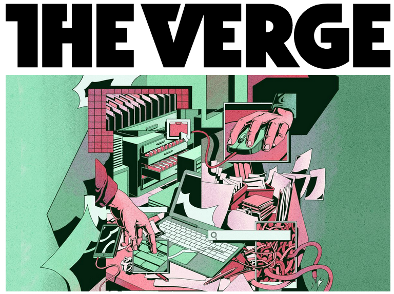

# 「我的文件在哪里」——缺乏电脑常识的一代

原文标题：*Kids who grew up with search engines could change STEM education forever*

原文链接：[https://www.theverge.com/22684730/students-file-folder-directory-structure-education-gen-z](https://www.theverge.com/22684730/students-file-folder-directory-structure-education-gen-z)

原文作者：Monica Chin

插画：Micha Huigen

本文原文以及插图的著作权归属其原作者所有。

---

早在 2017 年，天体物理学家凯瑟琳·加兰（Catherine Garland）就发现了这样一个诡异的现象：她在自己教授的课程中要求学生使用仿真软件来对发动机的涡轮进行模拟。她觉得自己的讲义已经写得很清楚了，但总是不断有学生找到她寻求软件使用的帮助。这些找到她的学生都遇到了同样的问题：软件找不到他们的文件。

加兰觉得这应该不是什么大问题。于是，她询问每一个前来求助的学生「你把你的项目保存到哪了」——也许是在桌面上？又或者在共享文件夹中？然而，她得到多数的回答却是：「不好意思，您在问什么？」那些学生不仅不知道自己把文件保存在了哪里——他们甚至不能理解「你把文件保存在哪里」这个问题本身。

渐渐地，加兰发现了一个事实：像「文件」和「文件夹」这样上一辈人都能轻松理解的电脑常识，大学生对它们居然相当陌生。事实上，不只是加兰，她的同僚们在过去的几年中不断地发现和证实着这一匪夷所思的现象。

## 「我的电脑就像一个整理得井井有条的橱柜」

教授们对于年轻人的这种对电脑知识的「脱节」有着不同的回忆，但他们对这一现象的估计（即使是最初步的估计）惊人的相似。这种问题已经持续数年了——大约是从 2017 年起，许多教师们就陆陆续续发现了这种现象。

在那一年，萨赛克斯大学的心理学教授林肯·科林（Lincoln Colling）让自己的研究生从特定的目录找一个文件，却收到了全班近乎茫然的目光；与此同时，哥伦比亚金融及技术大学的应用物理学家兼讲师尼古拉斯·瓜林·萨帕塔（Nicolás Guarín-Zapata）注意到，自己的学生不知道怎么找到自己的文件；也是在这一年，有老师在互联网上求助，因为他不知道怎么给学生解释「什么是文件」这样一个明明不需要解释的问题。

瓜林·萨帕塔老师自己自然知道怎么管好自己的文件。在电脑上，他的文件夹和文件有条不紊；在手机上，他把自己的照片分门别类。他在 21 世纪初上的大学，而在那时他需要把各种各样的纸质文件整理好。今天，他把自己电脑的硬盘比作文件柜：「我的电脑就像一个整理得井井有条的橱柜——我打开一个抽屉，在那里面，我又有一个有着更多抽屉的小柜子，」他告诉《The Verge》，「那像一个嵌套的结构。凭着这个结构，我能快速而有效地找到每一个我需要的东西」。

这个「柜子」的比喻，其实就是我们所说的「目录结构」，这样的层级结构就是今天的操作系统编排文件的方式。今天的电脑并不是把所有的文件胡乱地平摊在一个无穷大的平面上；相反地，文件是存储在各种各样的文件夹里的——譬如「下载」文件夹，「桌面」文件夹，「文档」文件夹——所有的文件夹都在「此电脑」当中，而每个文件夹又可以包含更多的子文件夹。对于从软盘时代就开始用电脑的人来说，这是非常直观的想法。

更广泛地说，目录结构对应着「位置」这个实际生活中的概念——文件存储在电脑上，就好像是文件被放置在电脑中某个特定的位置。加兰老师觉得这个概念显而易见，但她的学生却不是这样。「我就觉得，每个文件都应该被放在对应的文件夹里，然后我需要前往那个文件夹去取用那个文件，」加兰说，「但他们（学生们）却把电脑看成一个桶，然后一切都在那个桶子里。」

## 「每次我尝试去整理一下这些文件时，结果总是一团糟」

普林斯顿大学的大四学生约书亚·德罗斯曼（Joshua Drossman）在记忆中对「计算机系统」的理解是：「直观说，那就像一个洗衣篮，你可以把所有东西都扔进去，然后在需要的时候翻找你要的东西。」

作为运筹学和金融工程专业的学生，德罗斯曼学过编程——这意味着他是知道所谓「文件」或者「文件夹」这些概念的，他也知道整理文件在自己领域的重要性。但他并不总是能整理好自己的文件。在他最近一个长达九个月的项目进行到一半时，项目的文件数量迅速增长，而他最终放弃去整理和归类它们：「我是努力地去整理过它们。但在某一个时刻之后，文件太多了，多得像一团乱麻。」最后，他选择将文件扔进一个巨大的文件夹里，草草了事。

乔治·梅森大学的天文物理学助教彼得·普拉夫钦（Peter Plavchan）在他的学生身上见到过这样类似的行为，但他并不完全理解。「在我的实验室，学生们就那样把成百上千的文件往桌面上乱摆，」他有点不可思议地告诉《The Verge》，「我在管理文件这方面有点强迫症……而他们却能够忍受一个文件夹里塞满了一千个文件。我们访问文件的方式可能有不同吧，我觉得。」

另一方面，德克萨斯农工大学新闻专业的学生奥布里·沃格尔（Aubrey Vogel）则和德罗斯曼有着差不多的感受。她曾经认真地组织和管理自己的文件——在小时候，她祖父就教过她怎么在文件夹中妥善保存文件。但她长大后，她就把那些条条框框给扔了：现在，她把学校作业的文件放在一个巨大的文件夹里，与实习和工作相关的文件则放在另一个文件夹中。至于那些她不知道应该放在哪个文件夹的其他文件，就统一放进第三个文件夹——「杂」。

「每次我尝试去整理一下这些文件时，结果总是一团糟，」沃格尔这样说。「我的家人每次看见我电脑屏幕就会说我——那上面仿佛有几万个文件。」

## 「iPhone 面世时，这些大学生还在上小学；另一方面，他们的年龄和谷歌差不多」

为什么现在年轻人管理文件的观念和过去差别这么大？就德罗斯曼而言，他对此「一无所知」。他说：「好像从我用电脑开始，我就从来没有想过这件事。」

这或许是因为，那些教授们所推崇的「文件柜」式的观念已经不再适用了：许多和德罗斯曼一样年纪的学生在中学阶段就习惯于把自己的文件存储在诸如 OneDrive 或 Dropbox 这样的「网盘」中，而不是自己的硬盘上。这也可能与他们习惯的其他软件有关——Instagram、抖音、Facebook 和 YouTube 等主流手机 app 都是从浩瀚的内容海洋中「抽取」内容呈现给用户，而不是顺着嵌套的层级结构去寻找它们。「当我刷 Snapchat 和推特时，它们（内容）并不是按某种规则或者顺序来的，但我依然能精确地知道我想看的东西在哪，」沃格尔说。她算是一个「资深」的 iPhone 用户，而这种感觉已经形成了肌肉记忆。

另一方面，这也有可能是因为今天的系统都为用户提供了「搜索文件」这样的功能。借助这样的功能，年轻人不再需要关注「文件夹」或者「目录」这样的东西。第一批互联网搜索引擎诞生于 1990 年前后，但像 Windows 搜索和 macOS 上的「聚焦」这样的文件搜索功能都是在 2000 年前后推出的。今天 2017 级的大学生大都出生在上世纪九十年代末：iPhone 面世时，他们刚好在上小学；另一方面，他们的年纪和谷歌差不多。那些大学教授学习电脑时，并没有「文件搜索」这样的东西；而今天的学生显然是无法想象那样一个世界的。

「当年，我们用电脑必须要知道什么是文件，知道怎么保存它，知道它被放在了哪里。没有什么搜索功能的，」曼哈顿社区学院的天文学教授萨维克·福特（Saavik Ford）这样说道。但在她的学生中，「他们没有『文件是分门别类放在特定的地方的』这样的概念，他们直接搜索某个想要的文件，然后把它拎出来。就好比他们有个装满衣服的洗衣篮，而一个智能机器人则帮助他们取出每一件想要的衣服。」

在某种程度上，年轻人管理文件的观念反映了一种自然的——也是被预期的——技术进步。普拉夫钦老师回忆起，自己和自己的教授也有过这样的「脱节」。「当我还在当学生时，我很清楚有个教授说过，『哦天哪，我无法理解居然有人不会往主板上焊芯片，』」他说，「这种代际之间的『脱节』随处可见。」尽管目录结构这样的东西在今天的每台电脑（以及像 Google Drive 这样的网盘）上都存在，但今天的 macOS 和 Windows 都在尽力向普通用户隐藏那些细节。（你的 Steam 游戏都被放在一个叫做 `steamapps` 的文件夹中——但你上次打开这个文件夹是什么时候呢？）今天的虚拟世界很大程度上都是「可搜索」的；换言之就是，今天的人们并不十分需要与嵌套的层级结构打交道。

可是，在理工科领域，（合理的）目录结构依然是无比重要的。普拉夫钦老师举了个这样的例子：对于天文学者来说，他们经常要与成百上千的同种格式的一大堆文件打交道。在这种情况下，搜索工具的作用就相当有限。

一个更主要的问题则是，工程领域常要在命令行上编写和运行代码，并访问各种各样的文件——而在命令行条件下，「搜索文件」并非易事。有些编程语言有文件搜索的功能，但既不好实现也不常用。学生的那种随意摆放文件的习惯，在各门编程课上带来了不小的问题。

## 「他们和我们用电脑的方式完全不一样，这就是问题的开始」

中学的信息技术课——尤其是编程课——热度持续走高。可是，那并没有为学生更好地学习大学课程做好铺垫。瓜林·萨帕塔老师在高中时就学习了基本的电脑知识——怎么保存文件，怎么创建文件夹，怎么在终端中访问目录——这是他今天的许多学生所没有掌握的知识。加兰老师的那些学生，除了去学习更高级的理工科课程，否则压根就不会知道什么是「目录结构」。沃格尔则回忆说，她在一年级的电脑课上就试过将文件放置在文件夹中，可是从来没有人告诉她什么是「文件夹」。而今天，在教育领域越来越强调所谓「21 世纪的技能」的情况下，这些课程更是远远地落在了后面。

愤世嫉俗者会感慨这一代人的无能。一项 2018 年的国际研究对一批八年级学生的「有效使用信息和电脑技术的能力」进行了测试，而结果表明，所谓「Z 世代」只有 2% 的人达到了所谓「数字原住民」的电脑素养水平。一位教育家感慨道，「我们的学生深陷困境」。

而现在的问题并不是学生学习的「数字时代的技能」太少，而是他们学的东西跟以前不一样。就比如说，尽管瓜林·萨帕塔老师能把自己的文件整理得有条不紊，可注册账号已经一年多了，他依然不如学生会玩 Instagram。他曾让学生教他使用 Instagram，可「我还是用不明白啊」，他抱怨道。

「他们和我们用电脑的方式完全不一样，」他说，「这就是问题的开始。」

福特相当同意这个观点。「他们都是聪明的小孩，」她说，「他们在天文领域都很出色，他们学到了各种各样的知识。可他们没有学到这个（整理好自己的文件）。」

无论原因如何，这一切的后果是显而易见的。今天的理工科教师们扮演者双重角色：他们既是专业领域的教授，又是电脑操作基础的辅导老师。

现在，科林老师在课程中用整整两个课时来向学生解释什么是「目录结构」。他将「寻找文件」和「开车」联系在了一起：他向学生展示由文件和目录构成的「地图」，然后让学生寻找从某处「走」到指定位置的「路」。为了让学生理解文件和文件夹的概念，他用上了一切能想到的方法。

## 「没收他们的手机，然后强制他们用 Windows 98」

普拉夫钦老师现在也花了很多时间来教学生「目录」的相关知识，以及其他的电脑使用尝试，例如文件的扩展名和终端操作。瓜林·萨帕塔老师则在新学期开了一门类似的课。「在这门课上我先从理论的模型开始，讲讲什么是电脑，」他说，「从内存、硬盘，到用户界面和目录结构。」

但这些概念实在不好教授。不仅因为目录结构什么的对学生来说并不熟悉——是因为教授们对这些东西再熟悉不过了，以至于他们不知道怎么把它们跟学生讲清楚。一位教育家在 2019 年的一篇帖子中感叹：「我们都知道什么是文件，可是我不知道怎么给学生解释它。」受访者也有同样的看法，福特就在推特上寻求好的类比，并得到了各种各样的建议：树枝和树叶，抽屉里的厨房用具，以及图书馆里的书籍和书架。「（这个问题的绝佳解决方案，就是）没收他们的手机，然后强制他们用 Windows 98。」

即使给学生展示了无数容易理解的比喻，科林老师依然不觉得他的学生真的理解了他在说什么：「我感觉好像我取得了一些成功，但是，有时那又不好说。」

普拉夫钦也觉得他弥合「代沟」的能力相当有限。尽管他努力调整自己的教学，「我们使用的一些工具却依赖于学生根本没学过的知识。」

与此同时，另一些人则相信，应该改变的不是学生，而是教授们。常年与那些困惑的学生打交道，让加兰老师觉得「洗衣篮子」式的文件管理可能是一种更好的观念。她开始看到原来的「文件柜」式的文件管理在自己生活中的局限性；她也开始用搜索功能来寻找那些在一层层文件夹中难以寻觅的文件。「我现在……呃……我其实不需要那么多子文件夹，」她说。

即使是那些已经将文件夹和目录结构相关内容放进课程中的老师们，也在怀疑他们坚持的是不是某种过时的方法。普拉夫钦老师曾想过开一门单独的课程来教学生这些，但他不是很确定这是否值得。「我想到我们的学生……他们会长大，有些人也会变成老师，他们会编写自己的工具软件，他们的一切都是基于他们自己的观念——与我们完全不同的观念。」

普拉夫钦老师给自己的同僚的建议是：「做好准备」。「这不会消失，」他说。「一切都不会再变成过去的样子的。你必须接受现实，越早越好。」