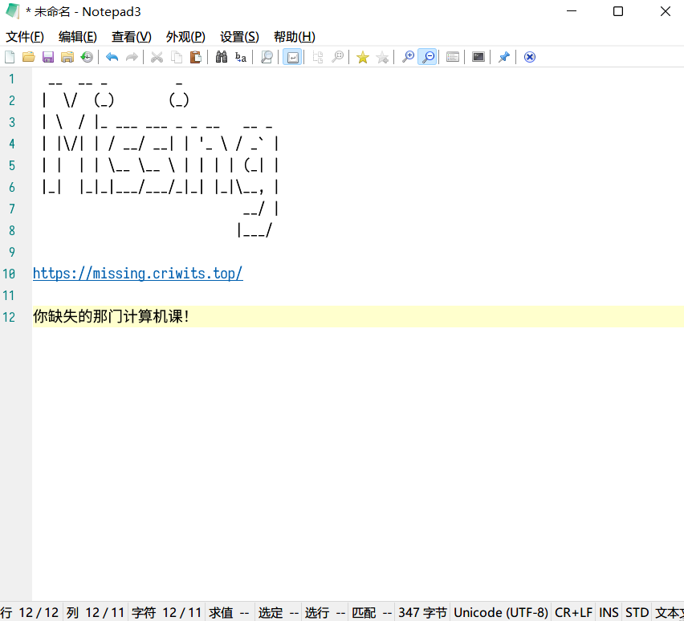

# 工具类软件推荐

本章我们介绍一些好用的「工具类软件」，例如视频播放器、下载工具、PDF 查看器等。我们尽量保证推荐的工具软件体积小巧，界面简洁，功能强大，同时尽量以开源、免费软件代替收费、破解软件。看完这一部分，你将能找到这些问题的答案：

- 有无好用的本地视频播放器软件（替代 QQ 影音 / 暴风影音 / ……）？
- 有无好用的下载工具（替代迅雷 / IDM / ……）？
- 有无好用的 PDF 查看器（替代福昕阅读器 / Acrobat / ……）？
- 有无好用的文件搜索工具（替代 Windows 自带「搜索功能」）？
- 有无好用的硬盘空间分析器（替代各大安全软件中的类似功能）？
- 有无好用的……（替代……）？

---

> 本章会持续更新。
> 

与 Office 那样的工作软件和 QQ 那样的生活软件不同，工具类软件强调「实用」——在更好地实现本职功能的同时，追求小巧和简洁。本章将推荐一批我们认为比较「优质」的工具类软件，大家可以按需安装使用。

## 文档类

这一节介绍「文档类」实用工具，例如文本编辑器和 PDF 阅读器。

### Notepad3

官网下载地址：[https://www.rizonesoft.com/downloads/notepad3/](https://www.rizonesoft.com/downloads/notepad3/)

Notepad3 是一款用来替代系统内置「记事本」的文本编辑器。它具有语法高亮、代码折叠、括号匹配、自动缩进、自动编码、多次撤销以及高级搜索等许多功能，适用于替代记事本进行简单的文本编辑，以及进行轻度的代码编写。

与 Notepad3 类似的软件还有 Notepad++ 和 Sublime 等。这里我们 **不推荐** 大家使用 Notepad++——尽管网上许多教程推荐它，尽管那也是一款非常优秀的文本编辑器。Notepad++ 的主要开发者屡次让政治立场混入技术世界，以「自由」之名行「渗透」之实，因而还需要大家审慎对待。

### SumatraPDF

官网下载地址：[https://www.sumatrapdfreader.org/download-free-pdf-viewer](https://www.sumatrapdfreader.org/download-free-pdf-viewer)

SumatraPDF 是一个小巧（安装包不到 10 MB）却功能强大的 PDF 阅读器。除了基本的 PDF 阅读功能外，它还可以帮助我们「记忆」打开过的文档和它们的阅读位置，因而省去每次打开文件都重新翻页的烦恼。

## 影音类

这一节介绍「影音类」实用工具，例如本地视频播放器。

### VLC Media Player

官网下载地址：[https://www.videolan.org/vlc/](https://www.videolan.org/vlc/)

VLC Media Player 是一个出色的本地视频播放器，它支持几乎所有常见格式的视频文件的播放，可以说是一个「万能」的播放器。与 VLC 类似的软件还有 PotPlayer，但 VLC 是开源而自由的软件，因而我们在这里推荐 VLC。

*The Crimson Wing: Mystery of the Flamingos* (C) Disney / Disneynature. All rights reserved.

## 网络类

这一节介绍「网络类」实用工具，例如下载器。

### Motrix

官网下载地址：[https://motrix.app/zh-CN/](https://motrix.app/zh-CN/)

Motrix，如它在网页上宣传的那样，是「一款全能的下载工具」，它基本上支持所有常见的资源协议的下载，包括 HTTP、FTP，以及群众喜闻乐见的磁力链接等。它界面精巧、代码开源、使用方便，是一款不可多得的优良下载工具。

## 文件类

这一节介绍「文件类」实用工具，例如文件搜索工具。

### SpaceSniffer

官网下载地址：[http://www.uderzo.it/main_products/space_sniffer/download.html](http://www.uderzo.it/main_products/space_sniffer/download.html)

SpaceSniffer——直白的名字，专注于磁盘空间分析嗅探。在你不知道是什么让你的硬盘空间步步吃紧时，它能够快速分析磁盘中每个文件、文件夹的大小，并以相应比例的方格显示出来，让你知道谁是罪魁祸首。

### Everything

官网下载地址：[https://www.voidtools.com/zh-cn/downloads/](https://www.voidtools.com/zh-cn/downloads/)

Everything，软件如其名，帮你寻找电脑上的一切！对于不经常整理文件的人来说，或许这个软件能为他们带来福音。它首先花点时间将你所有硬盘中的所有文件建立索引，之后便能在 **几乎瞬间** 找到你所想要的文件 / 文件夹（当然前提是你还依稀记得它们的名字啥的）。

## 杂烩类

这一节介绍能干许多不同方面事情的工具。

### PowerToys

官网下载地址：[https://github.com/microsoft/PowerToys/releases/latest](https://github.com/microsoft/PowerToys/releases/latest)，注意选择适合自己系统规格的文件，一般而言文件名含有 `Setup` 和 `x64`。

PowerToys 是由微软主导，集合社区之力共同开发的一套小工具集合，可以辅助我们进行各种各样的工作。这里简单介绍一下几个有用的模块：
- 始终置顶：快速将桌面上已经打开的任意窗口置顶。
- 唤醒：保持电脑处于唤醒状态（即不会自动休眠、睡眠或关机）。
- 颜色选择器：识别并提取屏幕上任意一点的颜色，获取它在各种颜色表示方式下的色值。
  
- File Locksmith：识别哪些程序正在占用文件，当删除文件时显示「此文件正被占用」时非常有用。
  
- 资源管理器加载项：在资源管理器中提供 SVG、PDF 等文件的图标中预览。
  
- 键盘管理器：重映射按键，例如设置按下 `A` 键其实是按下 `Ctrl` + `C` 快捷键等。
- PowerToys Run：非常强大的快速启动器与搜索工具，输入一些关键字，它可以让你快速打开浏览器进行搜索、运行电脑上含有关键字的应用，甚至是搜索文件名含有关键字的文件（前提是令 Windows 编制好索引）。除此之外，使用特殊的指令，还可以快速进行数学计算、单位换算、执行命令行指令、打开指定路径等等，花样繁多。
  
- 文本提取器：快速屏幕 OCR 识别。

## 练习

不妨试试上面介绍的这些小软件？